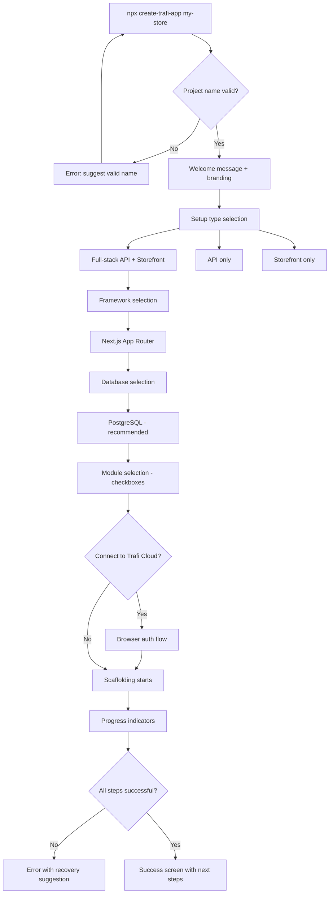
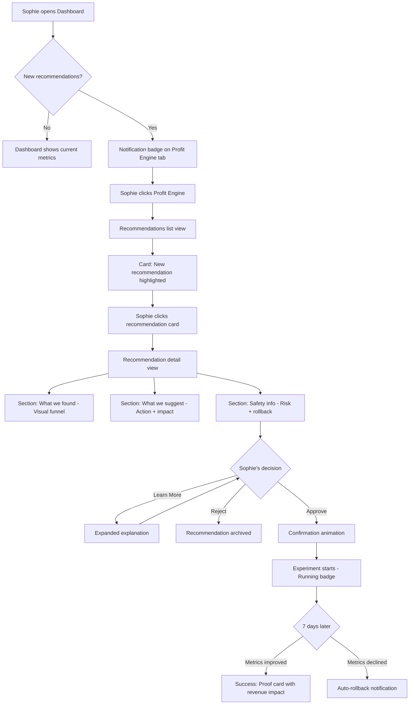
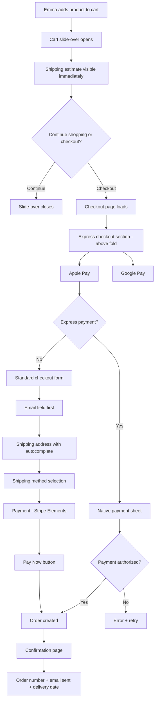
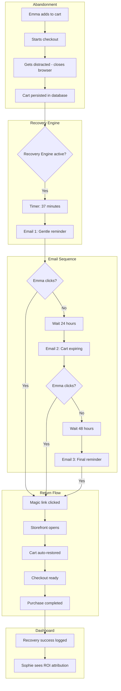

# UX/UI Design Specification — Trafi v2

**Theme:** Raw Intelligence
**Style:** Digital Brutalism / Swiss Utility
**Revision:** 2.0 (Brutalist Overhaul)
**Author:** Alex

---

## 0. Goal

Trafi's UI is not a "pretty dashboard". It is an **execution console** for an e-commerce OS.

This spec hard-aligns the interface with:

- **Autopilot ChangeSet** — auditable, reversible artifact
- **Override Kernel** — deterministic override resolution
- **Module System + Module Sandbox** — runtime extensibility with security boundaries

---

## Executive Summary

### Project Vision

Trafi is an open-source e-commerce platform that bridges the gap between developer flexibility and merchant success. The **Profit Engine** (Autopilot) acts as an intelligent co-pilot that instruments, diagnoses, proposes, proves, and protects — replacing 4 human roles (Growth/CRO, CRM/Lifecycle, Analytics/Data, Ops/Safety).

**UX Philosophy:** "The interface is a machine. No decoration, only data and action."

**Design Direction:**
- **Dashboard:** Digital Brutalism — radius-zero, visible grid structure, high contrast, acid accents
- **Storefront:** Same brutal aesthetic — the machine serves buyers too
- **System:** Pure Black (#000) + Pure White (#FFF) + Acid Lime (#CCFF00)

### Target Users

#### Primary: Thomas (Technical Builder)
- **Profile:** Fullstack developer/freelancer, 3-10 years experience, React/Node.js specialist
- **Goal:** Deliver complete e-commerce projects in 3-4 weeks instead of 3 months
- **UX Need:** Type-safe SDK, excellent documentation, clear customization paths, stable upgrade experience
- **Success moment:** "I can deliver a store with Profit Engine included — that's my new selling point"

#### Primary: Sophie (Business Operator - Indie/SMB)
- **Profile:** D2C brand creator, manages store alone or with 1-2 people, 100K-2M€ revenue
- **Goal:** Increase checkout conversion 15-30% without hiring a growth team
- **UX Need:** Clear recommendations, trustworthy proof, one-click approvals, no technical complexity
- **Success moment:** "The system told me what to do, I clicked approve, and my conversion went up"

#### Secondary: Emma (Final Buyer)
- **Profile:** Mobile-first consumer, values speed and transparency
- **Goal:** Complete purchase quickly without surprises
- **UX Need:** Fast checkout, visible shipping costs early, guest checkout, preferred payment methods prominent
- **Success moment:** "That was easy — I didn't even need to create an account"

### Key Design Challenges

#### 1. Dual Audience Complexity
The Dashboard serves both technical power users (Thomas configuring everything) and non-technical merchants (Sophie approving recommendations). The UX must implement **progressive disclosure** — showing complexity only when needed, keeping the default experience simple.

#### 2. Trust Through Transparency (Profit Engine)
Sophie must understand WHY a recommendation is made and trust the system enough to approve actions affecting her business. Statistical concepts (confidence intervals, significance, rollback triggers) must be visualized accessibly without dumbing down the intelligence.

#### 3. Performance vs Creative Expression (Storefront)
The storefront aims for bold, memorable design with rich GSAP animations and potential 3D elements, while maintaining strict Core Web Vitals compliance (LCP < 2.5s, CLS < 0.1, INP < 200ms). Animation budget must be carefully managed.

#### 4. Dual Onboarding Tracks
- **Developer track:** CLI-first, 5 minutes to functional store, documentation-driven
- **Merchant track:** Cloud signup, Shopify migration wizard, immediate value demonstration
Both must feel cohesive while serving different mental models.

#### 5. Mobile-First Checkout Optimization
With 60%+ e-commerce traffic on mobile, the checkout flow must be ruthlessly optimized: guest checkout default, Apple Pay/Google Pay prominent, shipping costs visible early, minimal form fields.

### Design Opportunities

#### Inverted CRO Workflow
Traditional CRO tools show data and expect merchants to figure out actions. Trafi inverts this: the system does the analysis and proposes specific actions via **Autopilot ChangeSets**. The UX opportunity is making "proposal → approval → proof → permanent" flow feel empowering.

#### Visual Profit Guardrails
Before any action executes, showing the merchant "this would reduce your margin on SKU-X below threshold" creates a differentiated trust moment. Guardrails are **fences, not pillows** — robotic, precise, reassuring through competence.

#### Confidence Through Rollback Visibility
Explicitly showing "AUTO-ROLLBACK: ARMED • DEVIATION > 5% = AUTO-KILL" reduces approval anxiety. The rollback isn't a failure state — it's a safety feature that enables experimentation.

#### The Collective Brain
When local traffic is insufficient for statistical significance, the UI substitutes "Local Uncertainty" with "Network Certainty" — showing "VALIDATED ON 1,240 STORES" when the merchant's own data is inconclusive.

#### Brutalist Identity
The interface is a machine. No decoration, only data and action. This signals to both developers and merchants: "This is a serious tool that respects your intelligence."

---

## 1. Design Manifesto

### The Interface is a Machine

- **No decoration** — only data, structure, and action
- **Radius-zero** everywhere — everything is a rectangle
- **Visible grid** — 1px borders expose structure
- **High contrast** — pure black background, pure white text
- **Acid accents** — signals for action (#CCFF00), stability (#00FF94), risk (#FF3366)
- **Monospace for data** — it should look like terminal output

### UX Philosophy — "The Collective Brain"

The UI must bridge:

| State | Visualization |
|-------|---------------|
| **Local Uncertainty** | Low traffic → inconclusive tests → "INSUFFICIENT DATA" (muted) |
| **Network Certainty** | Federated learning → "VALIDATED ON N STORES" (bright acid) |

**Tone shift:**
- Before: "Try this?"
- Now: "Network confirms this works on 850 stores."

### Brutalist Design Pillars

| Pillar | Implementation |
|--------|----------------|
| **Strict Radius Zero** | `border-radius: 0px !important` enforced globally |
| **Visible Grids** | Borders (1px solid #333) separate every element |
| **High Contrast** | Pure Black (#000) background, Pure White (#FFF) text |
| **Acid Accents** | #CCFF00 for action, #00FF94 for success, #FF3366 for risk |
| **Monospace Data** | JetBrains Mono for all numbers, metrics, code |
| **No Shadows** | Elements sit firmly in the grid, no floating |
| **No Gradients** | Colors are solid and flat |
| **Instant Feedback** | Hover = instant inversion, no slow transitions |

## Core User Experience

### Defining Experience

Trafi delivers three distinct but interconnected user experiences, each with a clear core action:

**Dashboard (Merchant Back-Office)**
- **Core Action:** "See diagnostic → Understand → Approve in 1 click"
- **Primary User:** Sophie (Business Operator) for daily decisions, Thomas (Developer) for configuration
- **Experience Goal:** Transform complex e-commerce analytics into simple approve/reject decisions

**Storefront (Buyer Frontend)**
- **Core Action:** "Add to cart → Checkout → Payment in < 90 seconds"
- **Primary User:** Emma (Final Buyer), mobile-first consumer
- **Experience Goal:** Fastest path from intent to purchase with zero friction

**Developer Experience (CLI/SDK)**
- **Core Action:** "5 minutes from zero to functional store with Profit Engine"
- **Primary User:** Thomas (Technical Builder)
- **Experience Goal:** Immediate productivity, type-safe confidence, stable long-term relationship

### Developer Experience (Detailed)

#### CLI: The Dev Workflow Orchestrator

The Trafi CLI (`trafi` or `npx @trafi/cli`) is not a simple scaffolder — it's the primary interface for all critical developer operations.

#### Key Commands & Interactions

**1. `trafi init` (or `create-trafi-app`)**

Interactive wizard that configures the project based on dev choices:

```bash
$ npx create-trafi-app my-store

✨ Welcome to Trafi! Let's set up your store.

? Choose your setup:
  ❯ Full-stack (API + Storefront)
    API only (headless backend)
    Storefront only (connect to existing API)

? Select storefront framework:
  ❯ Next.js (App Router)
    Remix (soon)
    Nuxt (soon)
    None (API only)

? Choose your database:
  ❯ PostgreSQL (recommended)
    MySQL

? Select modules to enable:
  ☑ Jobs
  ☑ Builder
  ☑ Payment (Stripe)
  ☑ Review
  ☐ Wishlist
  ☐ Advanced Promotions

? Connect to Trafi Cloud?
  ❯ Yes (managed hosting)
    No (self-host)

🚀 Creating your store...
✅ Project created! Run `cd my-store && pnpm run dev`
```

**Expected Experience:**
- Clear questions with smart defaults
- Inline explanations for complex choices
- Total time: 2–3 minutes
- Result: functional project with seed data included

**2. `trafi module`**

Module management (enable, disable, create templates):

```bash
# List available modules
$ trafi module list
Available modules:
  wishlist       ✗ (disabled)
  promotions-adv ✗ (disabled)

# Enable a module
$ trafi module add wishlist
✅ Wishlist module enabled
📝 Run migrations: pnpm run migrate

# Create custom module from template
$ trafi module create my-custom-module
? Module type:
  ❯ Commerce (extends core)
    Integration (3rd party)
    Custom logic

✅ Module scaffolded in /modules/my-custom-module
```

**3. `trafi upgrade`**

Intelligent upgrade with breaking change detection:

```bash
$ trafi upgrade

🔍 Checking for updates...
Current: v1.2.0
Latest: v1.5.0

⚠️  Breaking changes detected in v1.5.0:
  - Payment API: `createPayment()` signature changed
  - Migration required for Order schema

? Upgrade strategy:
  ❯ Guided (show changes + migration steps)
    Automatic (run migrations automatically)
    Cancel

✅ Upgraded to v1.5.0
📖 Migration guide: https://docs.trafi.dev/migrate/1.5.0
```

**4. `trafi cloud`**

Connection/deployment to Trafi Cloud:

```bash
# Initial connection
$ trafi cloud login
🔐 Opening browser for authentication...
✅ Logged in as alex@example.com

# Deployment
$ trafi cloud deploy
🚀 Deploying to Trafi Cloud...
✅ Deployed! https://my-store.trafi.app
📊 View dashboard: https://admin.trafi.app/stores/my-store
```

### Platform Strategy

| Surface | Platform | Input Priority | Responsive Strategy |
|---------|----------|----------------|---------------------|
| Dashboard | Web | Keyboard + Mouse | Desktop-optimized, tablet-friendly, mobile-functional |
| Storefront | Web | Touch-first | Mobile-first, desktop-enhanced |
| CLI | Terminal | Keyboard | N/A |
| SDK | IDE | Keyboard | N/A |

**Key Platform Decisions:**
- Dashboard assumes desktop as primary context (data-dense interfaces work better with larger screens)
- Storefront assumes mobile as primary context (60%+ e-commerce traffic)
- Dark mode is native identity for Dashboard, not an afterthought
- No native mobile apps in MVP — web-first strategy
- PWA capabilities for Storefront considered for P1 (offline catalog browsing)

### Effortless Interactions

These interactions must feel completely natural and require zero cognitive load:

| Interaction | Target Experience | Design Implication |
|-------------|-------------------|-------------------|
| **Approve recommendation** | Single click, no forms, no confirmation dialogs for low-risk actions | Large, clear CTA with inline context |
| **Guest checkout** | Zero account creation, zero password, just email for receipt | Email field only, no "create account" prompts during flow |
| **View shipping cost** | Visible immediately when item added to cart | Shipping estimate component on cart, not hidden until checkout |
| **Restore abandoned cart** | One click from email, cart intact, ready to pay | Deep link directly to checkout with cart state preserved |
| **Rollback action** | Automatic when metrics decline, visible status in dashboard | Rollback status badge on every active experiment |
| **SDK integration** | Type hints guide implementation, errors caught at compile time | Comprehensive TypeScript definitions, IDE autocomplete |
| **Change brand color** | Zero code, instant preview, persists across sessions | Color picker in settings, live preview mode |

### Critical Success Moments

These moments determine whether users succeed or fail with Trafi:

| Moment | Persona | Success Indicator | Failure Mode |
|--------|---------|-------------------|--------------|
| **First functional store** | Thomas | Working checkout in 5-10 minutes | Setup errors, unclear documentation, missing dependencies |
| **First diagnostic insight** | Sophie | Day 1 sees actionable recommendation | Empty dashboard, no data, unclear next steps |
| **First proven uplift** | Sophie | Statistical proof within 30 days | No significance, confusing metrics, distrust |
| **First completed purchase** | Emma | < 90 seconds, no friction | Hidden fees, forced account, slow performance |
| **First painless upgrade** | Thomas | Zero breaking changes, clear migration | Breaking API, lost data, unclear changelog |
| **First margin protection** | Sophie | System blocks harmful action | Margin erosion unnoticed, profit destruction |
| **First brand customization** | Owner | Store reflects brand identity in < 2 minutes | Complex config, no preview, broken theme |

### Experience Principles

Five guiding principles for all UX decisions:

**1. Action Over Information**
The system proposes specific actions, not just data visualizations. Every dashboard view leads to a clear next step. Metrics exist to inform decisions, not to be admired.

**2. Trust Through Transparency**
Every recommendation explains its reasoning. Every action shows its safety net. Statistical concepts are visualized accessibly. "Here's why, here's the proof, here's the undo."

**3. Mobile-First, Desktop-Rich**
Storefront is designed for thumbs first, then enhanced for cursors. Dashboard is designed for productivity on large screens, then made functional on smaller ones. Never the reverse.

**4. Five-Minute Magic**
First value must appear in minutes. `create-trafi-app` to working store: 5 minutes. Signup to first diagnostic: same session. The "aha moment" cannot wait for configuration.

**5. Zero Friction by Default**
Default settings eliminate obstacles. Guest checkout is default. Shipping shows early by default. Approval is one click by default. Complexity is opt-in, not opt-out.

## Desired Emotional Response

### Primary Emotional Goals

Each persona has a distinct emotional objective that drives their satisfaction with Trafi:

| Persona | Primary Emotion | Supporting Emotions |
|---------|-----------------|---------------------|
| **Thomas (Developer)** | Confidence & Control | Pride, Trust, Relief |
| **Sophie (Merchant)** | Security & Empowerment | Hope, Validation, Gratitude |
| **Emma (Buyer)** | Ease & Transparency | Satisfaction, Trust, Delight |

**Core Emotional Promise:**
- **To Developers:** "You're in control. The tools work. Upgrades don't break things."
- **To Merchants:** "You're protected. The system helps you win without risk."
- **To Buyers:** "No surprises. Fast. Easy. Done."

### Emotional Journey Mapping

#### Developer Emotional Journey (Thomas)

| Stage | Target Emotion | Design Response |
|-------|----------------|-----------------|
| **Discovery** | Curiosity → Intrigue | Bold positioning, clear differentiation from Medusa/Shopify |
| **First CLI Run** | Surprise → Excitement | 5-minute magic, working store with seed data |
| **First Client Project** | Confidence → Pride | Type-safe SDK, excellent docs, no checkout bugs |
| **Version Upgrade** | Serenity → Gratitude | Semver compliance, clear changelog, guided migration |
| **Long-term Use** | Loyalty → Advocacy | Stable platform, community engagement, contribution path |

**Emotions to Avoid:** Frustration (setup failures), Anxiety (breaking changes), Embarrassment (client-facing bugs)

#### Merchant Emotional Journey (Sophie)

| Stage | Target Emotion | Design Response |
|-------|----------------|-----------------|
| **Discovery** | Hope → Relief | "Finally, something I can use without a dev team" |
| **Onboarding** | Clarity → Excitement | Simple wizard, Shopify import, immediate value |
| **First Diagnostic** | Curiosity → Trust | Clear explanation, actionable insight, no jargon |
| **First Approval** | Courage → Empowerment | Low-risk first action, visible safety net |
| **First Proven Uplift** | Validation → Joy | Clear visualization, confidence intervals explained simply |
| **Guardrails Activation** | Security → Gratitude | "The system protected my margin" moment |

**Emotions to Avoid:** Overwhelm (too much data), Anxiety (fear of breaking store), Distrust (opaque recommendations)

#### Buyer Emotional Journey (Emma)

| Stage | Target Emotion | Design Response |
|-------|----------------|-----------------|
| **Browse** | Pleasure → Discovery | Beautiful storefront, smooth animations, fast loading |
| **Add to Cart** | Satisfaction → Anticipation | Clear feedback, visible shipping estimate |
| **Checkout** | Flow → Confidence | Guest checkout, minimal fields, trusted payment icons |
| **Payment** | Security → Serenity | Apple Pay prominent, 3DS when needed, clear confirmation |
| **Post-Purchase** | Accomplishment → Contentment | Instant confirmation email, tracking promise |

**Emotions to Avoid:** Surprise (hidden fees), Frustration (forced account), Anxiety (unclear order status)

### Micro-Emotions

Critical subtle emotional states that determine user satisfaction:

| Micro-Emotion Pair | Critical For | Design Approach |
|--------------------|--------------|-----------------|
| **Confidence vs Skepticism** | Profit Engine adoption | Show reasoning, show proof, show rollback option |
| **Control vs Helplessness** | Dashboard experience | Clear navigation, undo everywhere, no dead ends |
| **Security vs Anxiety** | Checkout conversion | Trust signals, payment icons, SSL indicators |
| **Accomplishment vs Frustration** | Developer onboarding | Working code immediately, clear error messages |
| **Delight vs Indifference** | Storefront differentiation | Thoughtful animations, attention to detail |
| **Trust vs Doubt** | Long-term retention | Consistent behavior, honest communication |

### Emotion-to-Design Implications

| Desired Emotion | UX Design Approach |
|-----------------|-------------------|
| **Confidence** | Transparency in every recommendation — show the data, the logic, the expected outcome |
| **Control** | Visible rollback on every experiment, "undo" as first-class citizen, no hidden automations |
| **Security** | Guardrails shown BEFORE action executes, confirmation dialogs for high-risk only |
| **Empowerment** | Positive language ("You can...", "Ready to..."), no technical jargon in merchant-facing UI |
| **Accomplishment** | Immediate feedback on every action, success states with micro-celebrations |
| **Delight** | Smooth GSAP transitions, thoughtful loading states, easter eggs in CLI |
| **Trust** | Consistent behavior, honest error messages, no dark patterns |

### Emotional Design Principles

**1. Safety First, Speed Second**
Users must feel safe before they can feel fast. Every risky action shows its safety net. Rollback is visible. Guardrails are proactive, not reactive.

**2. Explain, Don't Mystify**
The Profit Engine is intelligent, not magical. Every recommendation explains its reasoning in plain language. Statistical concepts are visualized, not hidden behind jargon.

**3. Celebrate Success, Soften Failure**
Success moments get micro-animations and positive feedback. Failures are handled gracefully with clear recovery paths. No dead ends, no blame.

**4. Progressive Confidence**
Start with low-risk actions to build trust. First recommendation should be obviously safe. Confidence grows through small wins before big decisions.

**5. Respect User Intelligence**
Don't dumb down — make complex things accessible. Merchants aren't stupid; they just don't have time. Developers aren't impatient; they just value their time.

## UX Pattern Analysis & Inspiration

### Inspiring Products Analysis

#### Developer Experience Inspirations (Thomas)

| Product | UX Strengths | Transferable Patterns |
|---------|--------------|----------------------|
| **Notion** | Blocks modulaires, slash commands, templates riches, zero learning curve | Module system architecture, documentation structure, storefront templates |
| **Supabase** | Dev-friendly dashboard, real-time logs, SQL editor, excellent DX | Dashboard monitoring, logs visualization, developer-first design |
| **Trigger.dev** | Elegant jobs dashboard, live logs, run timeline, one-click replay, code-first | Trafi Jobs UI architecture, execution history, payload inspection, retry UX |
| **Revolut** | Progressive onboarding, clear status cards, elegant dark mode | Progressive disclosure, status indicators, dark mode patterns |
| **monday.com** | Multiple views (table/board/timeline), visual automations | Order views, Profit Engine workflows, status boards |
| **Vercel** | Deployment flow, status indicators, minimal but powerful | CLI-to-cloud flow, deployment status, clean hierarchy |
| **Linear** | Keyboard-first, ultra-fast, command palette | Keyboard shortcuts, command palette potential (P1) |

#### Merchant Experience Inspirations (Sophie)

| Product | UX Strengths | Transferable Patterns |
|---------|--------------|----------------------|
| **Shopify Admin** | Mobile-first admin, push notifications, quick actions | Responsive dashboard, Profit Engine alerts |
| **Canva** | "Ready to use" templates, drag & drop, instant preview | Theme customization, live preview mode |
| **Notion** | Deceptive simplicity, hidden power, zero learning curve | Simple defaults, progressive feature discovery |
| **Zopa Bank** | Visual trust, clear explanations, total transparency | Profit Engine explanations, guardrails messaging, confidence building |

#### Buyer Experience Inspirations (Emma)

| Product | UX Strengths | Transferable Patterns |
|---------|--------------|----------------------|
| **Apple Store** | Ultra-fluid checkout, seamless Apple Pay, premium feel | Express checkout, payment integration, quality perception |
| **Jow** | Simplified journey, smart recommendations, mobile-native | Product recommendations, streamlined cart experience |
| **Zalando** | Powerful filters, integrated wishlist, easy returns | Product filtering, wishlist feature, return authorization flow |

### Transferable UX Patterns

#### Navigation Patterns

| Pattern | Source | Trafi Application |
|---------|--------|-------------------|
| **Sidebar + main content** | Vercel, Supabase | Dashboard layout structure |
| **Tab-based sections** | Stripe, Shopify | Settings organization, order details |
| **Breadcrumb navigation** | Most admin panels | Deep navigation in catalog/orders |
| **Command palette** | Linear, Notion | Quick actions (P1 feature) |

#### Interaction Patterns

| Pattern | Source | Trafi Application |
|---------|--------|-------------------|
| **Real-time logs streaming** | Trigger.dev, Supabase | Trafi Jobs execution monitoring |
| **Run timeline with duration** | Trigger.dev | Job execution history visualization |
| **One-click replay** | Trigger.dev | Failed job recovery without config |
| **Payload inspector** | Trigger.dev | Debug job inputs/outputs |
| **Live preview** | Canva | Theme color customization |
| **Progressive disclosure** | Revolut, Notion | Show complexity only when needed |
| **Inline editing** | Notion, Linear | Quick edits without modal |
| **Status badges** | All | Order status, job status, experiment status |

#### Visual Patterns

| Pattern | Source | Trafi Application |
|---------|--------|-------------------|
| **Dark mode as default** | Vercel, Linear | Dashboard identity |
| **Bento grid layouts** | Modern design trend | Dashboard widgets, storefront sections |
| **Frosted glass effects** | Apple, modern SaaS | Subtle depth, modal overlays |
| **Micro-animations** | Linear, Stripe | State transitions, success feedback |
| **Data visualization** | Stripe, Revolut | Profit Engine charts, conversion funnels |

#### Trust-Building Patterns

| Pattern | Source | Trafi Application |
|---------|--------|-------------------|
| **Transparent explanations** | Zopa Bank | Profit Engine recommendation reasoning |
| **Confidence indicators** | Financial apps | Statistical significance visualization |
| **Safety messaging** | Banking apps | Rollback visibility, guardrails alerts |
| **Progress indicators** | Onboarding flows | Experiment progress, goal completion |

### Anti-Patterns to Avoid

| Anti-Pattern | Where Seen | Why Avoid | Trafi Alternative |
|--------------|------------|-----------|-------------------|
| **Endless onboarding wizards** | Enterprise SaaS | Destroys "5-minute magic" promise | Minimal steps, smart defaults |
| **Hidden checkout fees** | Many e-commerce | Destroys trust, increases abandonment | Shipping visible from cart |
| **Technical jargon in UI** | Analytics/CRO tools | Alienates non-technical merchants | Plain language, visual explanations |
| **Forced account creation** | Most checkouts | Major conversion killer | Guest checkout as default |
| **Notification spam** | Mobile apps | Destroys engagement long-term | Quality over quantity alerts |
| **Dashboard overload** | Analytics tools | Users can't find what matters | Progressive disclosure, clear hierarchy |
| **Complex automation builders** | Workflow tools | Too much for MVP, intimidating | Pre-built playbooks, one-click approval |
| **Modal hell** | Legacy admin panels | Disrupts flow, frustrating | Inline editing, slide-overs |

### Design Inspiration Strategy

#### Patterns to ADOPT Directly

| Pattern | Source | Trafi Implementation |
|---------|--------|---------------------|
| Real-time logs streaming | Trigger.dev | Trafi Jobs dashboard live logs |
| Run timeline visualization | Trigger.dev | Job execution history with duration |
| One-click replay | Trigger.dev | Failed job recovery |
| Payload inspector | Trigger.dev | Job input/output debugging |
| Live preview theming | Canva | Brand color picker with instant preview |
| Express checkout | Apple Store | Apple Pay / Google Pay prominent |
| Trust through transparency | Zopa Bank | Profit Engine recommendation cards |
| Status badges system | Linear, Vercel | Consistent status indicators across all surfaces |
| Dark mode as identity | Vercel | Dashboard default, not afterthought |

#### Patterns to ADAPT for Trafi

| Pattern | Source | Adaptation |
|---------|--------|------------|
| Automation builder | monday.com | Simplify to Profit Engine playbooks (no complex drag & drop) |
| Template gallery | Canva | Storefront templates with preview, not full builder in MVP |
| Smart recommendations | Jow | Apply to Profit Engine suggestions, not product reco (P1) |
| Command palette | Linear | Consider for P1, not MVP complexity |
| Multiple views | monday.com | Start with single view per entity, add views in P1 |

#### Patterns to REJECT for Trafi

| Pattern | Reason |
|---------|--------|
| Complex drag & drop builders | Out of scope for MVP, conflicts with "5-minute magic" |
| Gamification/badges | Doesn't align with professional merchant audience |
| Social features | Not core to value proposition |
| AI chatbot support | Premature, documentation-first approach |
| Complex permission UI | Keep RBAC simple, avoid enterprise bloat |

## 2. Visual System (The Physics)

### Design System Choice

**Selected Approach:** Shadcn UI + Tailwind CSS 4.x with Brutalist Overrides

Trafi uses a **brutalist design system architecture** where:
- Design tokens enforce radius-zero, no-shadow, high-contrast globally
- Theme changes from Dashboard propagate to Storefronts without redeployment
- All components are wrapped in "Brutal" primitives that enforce the spec

This architecture enables no-code customization while enforcing the brutalist identity.

### Architecture Overview

#### Repository Structure

| Repository | Purpose | Design System Role |
|------------|---------|-------------------|
| **Trafi Monorepo** | API + Dashboard | Theme management, Builder editor, component schemas |
| **Storefront Monorepo** | Buyer-facing app | Theme consumption, BuilderRenderer, component registry |

#### Design System Flow

```
Dashboard (Theme Customizer)
        │
        ▼
   Database (JSON configs)
        │
        ▼
   API (GET /themes, /pages)
        │
        ▼
Storefront (ThemeProvider + BuilderRenderer)
        │
        ▼
   CSS Variables (runtime injection)
```

### Component Architecture

#### Global vs Local Pattern

Both Dashboard and Storefront follow the **local/global component pattern**:

**Global Components** (`/components/`):
- Shared across the entire application
- Shadcn UI primitives (Button, Card, Dialog, etc.)
- Layout components (Header, Sidebar, Footer)
- Domain components (ProductCard, DataTable)

**Local Components** (`/app/[route]/_components/`):
- Specific to a single route/page
- Consume global components
- Not reusable outside their context
- Colocated with their route for clarity

#### Dashboard Component Structure

```
@trafi/admin/
├── components/           # Global
│   ├── ui/              # Shadcn primitives
│   ├── layout/          # Shell, Sidebar
│   └── data-display/    # DataTable, Charts
└── app/
    └── [route]/
        └── _components/ # Local to route
```

#### Storefront Component Structure

```
@storefront/
├── packages/
│   ├── @storefront/ui/                 # Global UI components
│   ├── @storefront/builder-renderer/   # JSON → React transformation
│   ├── @storefront/builder-blocks/     # Block library (core + premium)
│   └── @storefront/theme-provider/     # Dynamic CSS variable injection
└── apps/web/
    └── app/
        └── [route]/
            └── _components/            # Local to route
```

### Dynamic Theme System

#### Theme Configuration Schema

```typescript
interface ThemeConfig {
  storeId: string;
  colors: {
    primary: string;      // Merchant brand color (default: orange)
    background: string;   // Dark mode: #0A0A0A
    foreground: string;   // Dark mode: #FAFAFA
    muted: string;
    border: string;
    success: string;
    warning: string;
    error: string;
  };
  typography: {
    fontFamily: string;
    headingWeight: number;
    bodyWeight: number;
  };
  spacing: {
    borderRadius: string;
    containerWidth: string;
  };
}
```

#### Theme Provider (Storefront)

```typescript
// Fetches theme from API and injects CSS variables at runtime
export function ThemeProvider({ storeId, children }) {
  const { data: theme } = useTheme(storeId);

  return (
    <>
      <style>{generateCSSVariables(theme)}</style>
      {children}
    </>
  );
}
```

**Key Benefit:** Merchants change brand colors in Dashboard → Storefront updates instantly without redeploy.

### Trafi Builder Architecture

#### Builder Capabilities

| Feature | Description |
|---------|-------------|
| **Visual Editor** | Drag-and-drop page building with live preview |
| **Component Marketplace** | Core blocks (free) + premium blocks (paid) |
| **No-Code/Low-Code Hybrid** | Visual editing + JSON/CLI for developers |
| **Multi-Storefront** | Publish pages to specific storefronts |
| **Preview Mode** | See changes before publishing |

#### Component Registry Pattern

```typescript
// @storefront/builder-renderer/registry.ts
export const componentRegistry: Record<string, ComponentType> = {
  // Core blocks (free)
  HeroSection: dynamic(() => import('@storefront/builder-blocks/core/hero-section')),
  ProductGrid: dynamic(() => import('@storefront/builder-blocks/core/product-grid')),
  CTABanner: dynamic(() => import('@storefront/builder-blocks/core/cta-banner')),
  Testimonials: dynamic(() => import('@storefront/builder-blocks/core/testimonials')),

  // Premium blocks (marketplace)
  // Dynamically registered based on store's purchased blocks
};
```

#### BuilderRenderer Component

```typescript
// @storefront/builder-renderer/renderer.tsx
export function BuilderRenderer({ blocks }: { blocks: Block[] }) {
  return (
    <>
      {blocks.map((block) => {
        const Component = componentRegistry[block.type];
        if (!Component) return <UnknownBlock key={block.id} type={block.type} />;
        return <Component key={block.id} {...block.props} />;
      })}
    </>
  );
}
```

#### Block Schema (for Builder UI)

```typescript
// Each block defines its props schema for the visual editor
export const heroSectionSchema: BlockSchema = {
  type: "HeroSection",
  name: "Hero Section",
  category: "Headers",
  props: {
    title: { type: "string", label: "Title", required: true },
    subtitle: { type: "string", label: "Subtitle" },
    ctaText: { type: "string", label: "Button Text", default: "Shop Now" },
    ctaLink: { type: "string", label: "Button Link" },
    backgroundImage: { type: "image", label: "Background Image" },
    alignment: { type: "enum", options: ["left", "center", "right"], default: "center" },
  },
};
```

### Animation Strategy (GSAP)

| Context | Animation Type | Timing | Example |
|---------|---------------|--------|---------|
| **Dashboard** | Micro-interactions | 150-200ms | Button hover, toggle, dropdown |
| **Dashboard** | Transitions | 200-300ms | Modal open, page navigation |
| **Dashboard** | Data updates | 300-500ms | Chart animations, counters |
| **Storefront** | Scroll animations | 400-600ms | Fade in, parallax |
| **Storefront** | Product interactions | 200-300ms | Quick view, add to cart |
| **Builder** | Drag feedback | Immediate | Ghost element, drop zones |

**Performance Constraint:** All storefront animations must respect Core Web Vitals (INP < 200ms).

### Customization Strategy

#### What Merchants Can Customize (No-Code)

| Element | Customization Level | Interface |
|---------|-------------------|-----------|
| **Brand Color** | Full (any color) | Color picker with live preview |
| **Typography** | Preset selection | Font family dropdown |
| **Border Radius** | Preset selection | Slider (0px - 16px) |
| **Logo** | Full | Image upload |
| **Page Content** | Full | Builder editor |

#### What Developers Can Customize (Code)

| Element | Customization Level | Method |
|---------|-------------------|--------|
| **Custom Blocks** | Full | Create block + register in registry |
| **Block Schemas** | Full | Define props schema for Builder UI |
| **Theme Extensions** | Additive | Extend CSS variables |
| **Layout Overrides** | Full | Override layout components |

### Implementation Phases

| Phase | Design System Deliverables |
|-------|---------------------------|
| **MVP** | Base Shadcn components, static theme (orange), core storefront components |
| **P1** | Theme customizer in Dashboard, ThemeProvider in Storefront, live preview |
| **P2** | Builder MVP (basic blocks, visual editor, publish flow) |
| **P3** | Component marketplace, premium blocks, advanced Builder features |

## Defining User Experience

### The Three Defining Experiences

Trafi has three distinct defining experiences, one for each primary surface:

#### 1. Dashboard: "The System Proposes, You Approve"

**The Tagline:** *"Profit Engine told me to show shipping costs earlier. I clicked Approve. My conversion went up 12%."*

This is Trafi's core differentiator. Unlike traditional analytics dashboards where merchants must interpret graphs and figure out actions, Profit Engine:
1. **Analyzes** the conversion funnel automatically
2. **Diagnoses** specific problems with data
3. **Proposes** concrete, actionable recommendations
4. **Proves** results with statistical significance
5. **Protects** via automatic rollback if metrics decline

**User Mental Model Shift:**

| From (Traditional CRO) | To (Trafi) |
|------------------------|------------|
| "I need to hire an expert" | "The system does the analysis" |
| "Charts I don't understand" | "Actions I can take" |
| "If I change something, it might break" | "If it doesn't work, it reverts automatically" |
| "I hope this works" | "I see statistical proof" |

#### 2. CLI: "5 Minutes to Magic"

**The Tagline:** *"I ran `npx create-trafi-app`, answered 5 questions, and had a working store with functional checkout."*

Thomas describes it to colleagues as: *"Shopify for devs, without the vendor lock-in."*

**User Mental Model Shift:**

| From (Traditional Headless) | To (Trafi) |
|-----------------------------|------------|
| "3 months minimum to build e-commerce" | "Working store in 1 day" |
| "Flexibility but complex setup" | "Flexibility AND batteries included" |
| "Breaking changes = lost weekends" | "Guided upgrades, strict semver" |

#### 3. Storefront: "Invisible Checkout"

**The Tagline:** *"I tapped Apple Pay, it was done. I don't even remember the steps."*

Emma doesn't talk about the checkout — she talks about the product. The checkout is **so invisible** it disappears from memory.

### User Mental Models

#### Sophie's Mental Model (Merchant)

**Before Trafi:**
- CRO = expensive consultants or complex tools
- Analytics = confusion, data overload
- Changes = risk, fear of breaking things
- Results = hope, no proof

**With Trafi:**
- CRO = system handles it, I validate
- Analytics = clear actions, not charts
- Changes = safe experiments with rollback
- Results = statistical proof I can trust

#### Thomas's Mental Model (Developer)

**Before Trafi:**
- E-commerce = massive undertaking, months of work
- Headless = freedom but pain (Medusa setup, Saleor complexity)
- Client projects = risky, checkout bugs are embarrassing
- Upgrades = dread, breaking changes nightmare

**With Trafi:**
- E-commerce = scaffolded in minutes, production-ready
- Headless = best of both worlds (flexibility + stability)
- Client projects = confident delivery with Profit Engine as selling point
- Upgrades = guided, safe, predictable

#### Emma's Mental Model (Buyer)

**Before (Bad Checkout):**
- "Why do I need an account?"
- "Where are the shipping costs?"
- "Is this site even secure?"
- "How many more steps?"

**With Trafi Storefront:**
- Guest checkout default = no friction
- Shipping visible from cart = no surprises
- Trust signals prominent = confidence
- Express payment first = minimal steps

### Success Criteria

#### Profit Engine Approval Flow

| Criterion | Measurement | Threshold |
|-----------|-------------|-----------|
| **Comprehension Time** | Sophie understands recommendation | < 10 seconds |
| **First Approval Rate** | % of first recommendations approved | > 60% |
| **Anxiety Level** | Rollback visibility | Always visible |
| **Proof Clarity** | Sophie understands it worked | < 30 days to see proof |
| **Return Usage** | Sophie checks dashboard again | Within 7 days |

#### CLI Setup Flow

| Criterion | Measurement | Threshold |
|-----------|-------------|-----------|
| **Total Time** | `create-trafi-app` → working store | < 5 minutes |
| **Error Rate** | Setup completes without errors | > 95% success |
| **First Checkout** | Can process test payment | Immediate |
| **Documentation Need** | Questions answered by wizard | Minimal docs lookup |

#### Checkout Flow

| Criterion | Measurement | Threshold |
|-----------|-------------|-----------|
| **Total Time** | Cart → Confirmation | < 90 seconds |
| **Form Fields** | Number of fields to complete | ≤ 6 fields |
| **Guest Checkout** | Available without account | Default option |
| **Express Payment** | Apple Pay / Google Pay | Above fold |
| **Shipping Visibility** | Cost shown | From cart page |

### Novel vs Established UX Patterns

#### Novel Patterns (Require User Education)

| Pattern | Innovation | Education Strategy |
|---------|------------|-------------------|
| **Proposal → Approval** | Inverts traditional CRO workflow | First recommendation is obviously safe; tooltips explain reasoning |
| **Automatic Rollback** | Rare in e-commerce tools | Prominent badge: "Auto-reverts in 7 days if metrics decline" |
| **Proactive Guardrails** | System blocks before damage | Warning modal with clear explanation before harmful action |
| **Statistical Proof** | Confidence intervals for merchants | Visual "confidence meter" with plain-language explanation |

#### Established Patterns (Users Already Know)

| Pattern | Source | Trafi Implementation |
|---------|--------|---------------------|
| **CLI Wizard** | create-next-app, create-t3-app | Same interaction model, familiar prompts |
| **Express Checkout** | Apple, Shopify | Apple Pay / Google Pay prominent, one-tap flow |
| **Dark Mode Dashboard** | Vercel, Linear | Default dark, matches developer expectations |
| **Sidebar Navigation** | Every SaaS admin | Standard layout, no learning curve |
| **Status Badges** | GitHub, Linear | Consistent color coding across all surfaces |

### Experience Mechanics

#### Profit Engine Recommendation Flow

**1. Initiation:**
- Dashboard → Profit Engine Tab → "New Recommendation" badge visible
- Sophie sees: Notification dot + card preview in sidebar

**2. Interaction:**
- Recommendation card shows: Title, Why, Expected Impact, Safety
- Three actions: Approve, Reject, Learn More
- Approve triggers experiment start

**3. Feedback:**
- Approve → Success animation + "Experiment started" toast
- Dashboard shows "Running" badge with progress
- Daily email digest (optional) with early results

**4. Completion:**
- Experiment Complete card shows: Result, Confidence level, Estimated revenue impact
- Status: Permanently applied or Rolled back
- Option to view full data

#### CLI Setup Flow

**1. Initiation:**
```bash
$ npx create-trafi-app my-store
```

**2. Interaction:**
- Interactive prompts with arrow key navigation
- Smart defaults pre-selected
- Inline explanations for complex choices

**3. Feedback:**
- Progress indicators for each step (scaffolding, dependencies, database, seeding)
- Clear error messages if something fails
- Recovery suggestions if issues occur

**4. Completion:**
- Success message with exact next steps
- Links to docs, local URLs for store and admin
- Total time displayed

#### Checkout Flow

**1. Initiation:**
- User clicks "Checkout" or cart icon
- Slide-over cart or dedicated checkout page

**2. Interaction:**
- Express checkout buttons (Apple Pay / Google Pay) prominently above fold
- Minimal form fields below: Email, Shipping address, Payment
- Shipping cost visible throughout

**3. Feedback:**
- Field validation inline (green checkmarks)
- Loading state on payment button
- 3DS redirect if required (clear messaging)

**4. Completion:**
- Success confirmation with order number
- Email confirmation sent immediately
- Estimated delivery date visible
- Track order CTA prominent

## Visual Design Foundation

### 2.1 Color Palette

**Philosophy: "The Void + The Signal"**

Trafi's color system follows a brutalist approach: pure black void punctuated by acid signals that demand attention.

#### Base Colors (The Void)

| Token | Value | Usage |
|-------|-------|-------|
| `--surface-0` | `#000000` | Main background |
| `--surface-1` | `#050505` | Cards, panels |
| `--surface-2` | `#111111` | Hover states |
| `--border` | `#333333` | The Grid — visible structure |

#### Signal Colors (The Acid)

| Token | Value | Usage |
|-------|-------|-------|
| `--primary` / `--acid-primary` | `#CCFF00` | CTA, active states, new intelligence |
| `--success` / `--acid-success` | `#00FF94` | Stability, profit, proven results |
| `--destructive` / `--neon-warning` | `#FF3366` | Risk, errors, rollback triggers |
| `--muted-foreground` | `#888888` | Labels, metadata |

#### Light Mode (Inverted)

| Token | Value | Usage |
|-------|-------|-------|
| `--background` | `#FFFFFF` | Main background |
| `--foreground` | `#000000` | Primary text |
| `--border` | `#E5E5E5` | Dividers |
| `--surface-1` | `#F8F8F8` | Cards |
| `--surface-2` | `#F0F0F0` | Hover |

#### Usage Rules

- **Never use gradients** — colors are solid and flat
- **Never use opacity for backgrounds** (except modals) — use solid colors
- **Invert colors on hover** — black text on acid background
- **No shadows** — elements sit firmly in the grid
- **No blur/glass effects** — brutalism rejects blur

#### Dark Mode as Default Identity

Dark mode is the **default** (not optional):
- Pure black (#000) creates maximum contrast
- Acid accents pop against void
- Data-dense interfaces need darkness
- Light mode available but secondary

### 2.2 Typography System

**Pairing: Space Grotesk + JetBrains Mono**

This pairing delivers "Technical Precision" — Space Grotesk is geometric and slightly wide with a "tech" feel, while JetBrains Mono handles all data and numbers with terminal authenticity.

#### Type Scale

| Element | Font | Weight | Size | Line Height | Treatment |
|---------|------|--------|------|-------------|-----------|
| H1 | Space Grotesk | 700 | 48px | 1.1 | **UPPERCASE**, tight tracking |
| H2 | Space Grotesk | 700 | 32px | 1.2 | **UPPERCASE**, tight tracking |
| H3 | Space Grotesk | 500 | 24px | 1.3 | **UPPERCASE** |
| H4 | Space Grotesk | 500 | 18px | 1.4 | **UPPERCASE** |
| Body | Space Grotesk | 400 | 14px | 1.6 | Normal case |
| Label | Space Grotesk | 700 | 10px | 1.4 | **UPPERCASE**, wide tracking (0.1em) |
| Data | JetBrains Mono | 400 | 14px | 1.5 | Numbers, metrics, values |
| Code | JetBrains Mono | 400 | 13px | 1.5 | Code, CLI output |

#### Font Usage Guidelines

- **Space Grotesk**: All headings and UI text — navigation, labels, buttons. Always uppercase for headings, tight tracking (-0.02em) or wide tracking (0.1em) for labels.
- **JetBrains Mono**: ALL numbers, metrics, table data, prices, percentages, dates. Data should look like it came from a terminal.
- **Rule**: If it's a number, it's monospace. No exceptions.

### 2.3 Layout & Density (The Grid)

**Philosophy: Separation via borders, not whitespace.**

Density is high. The interface is a professional console, not a marketing page.

#### Spacing Scale

| Token | Value | Usage |
|-------|-------|-------|
| --space-1 | 4px | Tight spacing, inline elements |
| --space-2 | 8px | Default gap, icon spacing |
| --space-3 | 12px | Form fields |
| --space-4 | 16px | Card padding |
| --space-6 | 24px | Section spacing |
| --space-8 | 32px | Large gaps |

#### Border Radius Scale

| Token | Value | Usage |
|-------|-------|-------|
| --radius-sm | **0px** | Buttons, inputs |
| --radius-md | **0px** | Cards, dropdowns |
| --radius-lg | **0px** | Modals, panels |
| --radius-xl | **0px** | Large containers |
| --radius-full | **0px** | Pills, avatars — still rectangles |

**There is no radius. Everything is a rectangle.**

#### The Border Rule

Elements are defined by their borders, not by whitespace or shadows.

**Grid Border Pattern (no double borders):**
```css
/* Parent has border-top border-left */
.brutalist-grid {
  display: grid;
  gap: 0;
  border-top: 1px solid var(--border);
  border-left: 1px solid var(--border);
}

/* Children have border-right border-bottom */
.brutalist-grid > * {
  border-right: 1px solid var(--border);
  border-bottom: 1px solid var(--border);
}
```

#### Dashboard Layout

- Fixed left sidebar: the vertical axis of the grid
- Main area: 3-4 column brutalist grid
- No card shadows — every panel is a bordered rectangle
- Gap: 0 — borders create separation

#### Storefront Layout

- Same brutalist grid pattern
- Full-bleed sections with max-width content (1280px)
- Product cards as bordered rectangles
- Checkout as single-column form in bordered container

### Accessibility Considerations

#### Contrast Requirements

| Element | Minimum Ratio | Target |
|---------|---------------|--------|
| Normal text | 4.5:1 | WCAG AA |
| Large text (18px+) | 3:1 | WCAG AA |
| UI components | 3:1 | Interactive elements |
| Focus indicators | 3:1 | Orange ring visible on all backgrounds |

#### Motion & Animation

- All animations respect `prefers-reduced-motion`
- GSAP animations use GPU-accelerated properties only (`transform`, `opacity`)
- No auto-playing videos or infinite animations
- Animation durations: 150-800ms based on context

#### Color Independence

Status indicators never rely on color alone:
- Success: Green + checkmark icon
- Warning: Yellow + triangle icon
- Error: Red + X icon
- Info: Blue + info icon

#### Keyboard Navigation

- All interactive elements focusable
- Visible focus states (2px orange outline)
- Logical tab order maintained
- Skip links for main content

### 7. Motion & Micro-interactions (Brutalist)

**Philosophy: Instant feedback. No slow fades.**

#### Timing Reference

| Context | Duration | Easing | Example |
|---------|----------|--------|---------|
| Hover states | **0ms** | instant | Color inversion, border snap |
| Button press | **0-50ms** | linear | Background change |
| Panel slide | **100ms** | ease-out | Slide from right, hard stop |
| Tab switch | **0ms** | instant | Whole tab block changes |
| Modal open | **0-100ms** | linear | Fade + slight scale |

#### Brutalist Motion Rules

- **Timing**: Instant (0-100ms). No slow fades.
- **Easing**: Linear or slight ease-out. No bounces.
- **Hover**: Instant color inversion + border snap.
- **No scaling/growing**: Keep the grid rigid.
- **Slide panels**: Hard stop from right edge.
- **Tabs**: No sliding underline. Whole block changes color instantly.

#### Performance Rules

- Use `transform` and `opacity` only — no layout-triggering properties
- Remove all `transition` by default in CSS
- Only allow transitions for specific elements (buttons, links)
- Budget: Max 16ms per frame (60fps target)

#### No "Cartoon Vibes"

Brutalism rejects playfulness. No bounces, no confetti, no easter eggs.
The machine is serious. Success is shown through data, not celebration.

## Design Direction Decision

### Design Directions Explored

Six design directions were created and evaluated:

1. **Pure Vercel** - Extreme minimalism, maximum density, pure dark mode
2. **Typology Elegance** - Refined monochrome, generous spacing, light mode storefront
3. **Bento Bold** - Expressive grids, cards with presence, pronounced orange accent
4. **Linear Flow** - Keyboard-first aesthetic, list/detail pattern, ultra-fast
5. **Creative Commerce** - Bold hero, gradients, visible GSAP animations
6. **Hybrid Pro** - Balanced synthesis of best practices with organized navigation

### Chosen Direction

**Dashboard: Bento Bold (3) + Hybrid Pro (6) Hybrid**

The dashboard combines:
- **Bento Bold's expressiveness**: Dynamic grid layouts, cards with visual presence, pronounced orange accent for Profit Engine highlights, impactful data visualizations
- **Hybrid Pro's structure**: Rail + sidebar navigation pattern, organized breadcrumb navigation, topbar with actions, status badges on cards

This creates a data-rich dashboard that feels both expressive and professional — the bento grid provides visual interest while the navigation structure keeps power users efficient.

**Storefront: Enhanced Typology Elegance (2)**

The storefront takes Typology's refined monochrome aesthetic and enriches it with modern trends:

| Enhancement | Implementation |
|-------------|----------------|
| **Bento Design** | Asymmetric hero grids, product showcases in bento card arrangements, category sections with varied card sizes |
| **Snug Simple** | Optimized padding that feels intentional not empty, elegant density without crowding, purposeful whitespace |
| **Frosted Touch** | Floating navbar with glass effect, cart slide-over with blur, modal overlays with subtle transparency |

The result is Typology's sophistication with contemporary depth and visual interest.

### Design Rationale

**Why this combination works for Trafi:**

1. **Dashboard serves power users**: Sophie needs to scan Profit Engine recommendations quickly; Thomas needs efficient navigation. The Bento grid makes data scannable while Hybrid Pro's navigation keeps everything accessible.

2. **Storefront serves brand expression**: Emma experiences the store as a brand touchpoint. Typology's elegance creates trust while Bento/Frosted trends add memorability without sacrificing performance.

3. **Consistent identity across surfaces**: Both share the monochrome + orange foundation, General Sans + Clash Display typography, and modern card-based layouts. The dark/light mode split reinforces the dashboard = tool, storefront = experience distinction.

4. **Supports the emotional goals**:
   - Dashboard: Confidence (clear data), Control (organized nav), Empowerment (actionable cards)
   - Storefront: Ease (elegant simplicity), Trust (sophistication), Delight (modern touches)

### Implementation Approach

**Dashboard Implementation:**
- 12-column CSS Grid with 16px gap
- Card component with hover states (border-color: primary)
- Rail navigation (64px) + Sidebar (240px) + Main content
- Topbar with breadcrumb + action buttons
- Status badges (success/warning/error) on metric cards
- Bento widget arrangement for Profit Engine section

**Storefront Implementation:**
- Responsive Bento grid: `grid-template-columns: repeat(auto-fit, minmax(280px, 1fr))`
- Floating header with frosted glass: `backdrop-filter: blur(12px)`
- Hero section with asymmetric 2-column layout
- Product cards with subtle hover lift
- Cart slide-over with glass background
- Full-bleed sections with max-width content constraint (1280px)

**Shared Components:**
- Button variants (primary orange, ghost, outline)
- Card base with consistent border-radius (8-12px)
- Badge component for status indicators
- Input fields with consistent styling
- Modal/Dialog with frosted overlay

## User Journey Flows

### Journey 1: CLI Onboarding (Thomas)

**Goal:** 5 minutes from `npx create-trafi-app` to functional store

**Entry Point:** Terminal command
**Success Criteria:** Working store with seed data, Profit Engine ready

#### Flow Diagram



#### Key Interactions

| Step | User Action | System Response | Optimization |
|------|-------------|-----------------|--------------|
| Command | `npx create-trafi-app` | Welcome + branding | Immediate feedback |
| Setup type | Arrow key selection | Highlight + description | Smart default selected |
| Framework | Arrow key selection | Only available options shown | Unavailable greyed |
| Database | Arrow key selection | Connection test automatic | Fail fast with help |
| Modules | Checkbox toggle | Dependencies explained | Recommended pre-checked |
| Cloud connect | Y/N | Browser auth if yes | Seamless OAuth |
| Scaffolding | Wait | Progress bars per step | Time estimates shown |
| Success | Review | Next steps + URLs | ASCII celebration |

#### Error Recovery

- Invalid project name → Suggest valid alternative
- Database connection fails → Show connection string fix
- Dependency install fails → Suggest cache clear + retry
- Cloud auth fails → Provide manual token option

---

### Journey 2: Profit Engine Approval (Sophie)

**Goal:** See diagnostic → Understand → Approve in 1 click

**Entry Point:** Dashboard notification badge
**Success Criteria:** Action approved with confidence, proof received within 30 days

#### Flow Diagram



#### Key Interactions

| Step | User Action | System Response | Emotional Goal |
|------|-------------|-----------------|----------------|
| Notice | See badge | Curiosity indicator | Intrigue |
| Browse | Click Profit Engine | List of recommendations | Discovery |
| Select | Click card | Detail view opens | Understanding |
| Evaluate | Read sections | Visual + plain language | Confidence |
| Decide | Click Approve/Reject | Immediate feedback | Empowerment |
| Monitor | Check dashboard | Running status visible | Anticipation |
| Celebrate | See results | Proof with revenue impact | Validation |

#### Safety Visualization

- **Risk Badge:** Low (green) / Medium (yellow) / High (red)
- **Rollback Promise:** "Auto-reverts in 7 days if metrics decline"
- **Guardrails Status:** "No margin impact" or warning if applicable
- **Confidence Meter:** Visual bar replacing statistical numbers

---

### Journey 3: Checkout Flow (Emma)

**Goal:** Cart → Payment → Confirmation in < 90 seconds

**Entry Point:** Add to cart action
**Success Criteria:** Order confirmed, email received, delivery date known

#### Flow Diagram



#### Key Interactions

| Step | User Action | System Response | Time Budget |
|------|-------------|-----------------|-------------|
| Add to cart | Click button | Slide-over opens | 0-5s |
| View cart | Review items | Shipping estimate shown | 5-15s |
| Start checkout | Click checkout | Page loads | 15-20s |
| Express pay | Tap Apple Pay | Native sheet | 20-35s |
| Authorize | Face ID / Touch ID | Processing | 35-45s |
| Confirm | See confirmation | Order number + email | 45-60s |

#### Fallback Path (Standard Checkout)

| Step | Fields | Optimization |
|------|--------|--------------|
| Email | 1 field | Returning customer detection |
| Shipping | Address form | Autocomplete enabled |
| Shipping method | Radio buttons | Prices + dates shown |
| Payment | Card form | Stripe Elements |
| Review | Summary | All costs visible |
| Submit | Pay button | Loading state |

---

### Journey 4: Cart Recovery (Sophie + Emma)

**Goal:** Recover abandoned carts through intelligent email sequence

**Entry Point:** Cart abandonment event (browser close during checkout)
**Success Criteria:** Customer returns and completes purchase

#### Flow Diagram



#### Email Sequence Timing

| Email | Delay | Subject | Content | CTA |
|-------|-------|---------|---------|-----|
| 1 | 37 min | Still thinking about it? | Single product image | Return to cart |
| 2 | 24 hrs | Your cart is waiting | Product + urgency | Complete purchase |
| 3 | 48 hrs | Last chance (optional) | Product + incentive | Complete purchase |

#### Recovery Flow

1. Magic link in email (no login required)
2. Storefront opens with cart auto-restored
3. Checkout page ready with all items
4. Express checkout available
5. Purchase completes
6. Sophie sees recovery attribution in dashboard

---

### Journey Patterns

#### Navigation Patterns

| Pattern | Description | Usage |
|---------|-------------|-------|
| **Progressive Disclosure** | Show essential first, expand on demand | Complex forms, settings |
| **Slide-over** | Non-blocking panel from edge | Cart, quick actions |
| **Wizard** | Step-by-step with progress indicator | CLI setup, onboarding |
| **List → Detail** | Master-detail with persistent list | Recommendations, orders |

#### Decision Patterns

| Pattern | Description | Usage |
|---------|-------------|-------|
| **Single-click Action** | No confirmation for low-risk | Approve recommendation |
| **Confirmation Modal** | Clear consequences stated | Delete, high-risk actions |
| **Inline Expand** | Accordion without page change | Learn more, details |
| **Smart Defaults** | Pre-selected recommended option | All selections |

#### Feedback Patterns

| Pattern | Description | Usage |
|---------|-------------|-------|
| **Progress Indicator** | Step count + current position | Multi-step flows |
| **Real-time Validation** | Green checkmark on valid field | Forms |
| **Toast Notification** | Auto-dismiss, non-blocking | Quick feedback |
| **Status Badge** | Color-coded, always visible | Ongoing processes |
| **Celebration Moment** | Subtle animation, positive message | Success states |

#### Error Recovery Patterns

| Pattern | Description | Usage |
|---------|-------------|-------|
| **Inline Error** | Red border + message below field | Form validation |
| **Retry Suggestion** | Clear button to try again | Failed actions |
| **Recovery Path** | Step-by-step fix instructions | Complex failures |
| **Graceful Degradation** | Continue with warning | Partial failures |

### Flow Optimization Principles

1. **Minimize Steps to Value** - Every screen must justify its existence
2. **Show Progress** - Users always know where they are and what's next
3. **Fail Fast, Recover Gracefully** - Errors caught early with clear recovery
4. **Celebrate Success** - Positive moments reinforce desired behavior
5. **Respect Time** - Mobile users especially have limited patience
6. **Reduce Cognitive Load** - One decision per screen when possible

## 3. Core UI Primitives

These primitives MUST be used everywhere. Developers never style from scratch.

### 3.1 Frame (The Basic Unit)

A "frame" is the basic layout unit: a rectangle with explicit borders.

```css
.brutal-frame {
  background: var(--surface-1);
  border: 1px solid var(--border);
  border-radius: 0;
  box-shadow: none;
}
```

### 3.2 Buttons

| Variant | Background | Text | Border | Hover |
|---------|------------|------|--------|-------|
| **Primary Action** | White | Black | White | Acid bg + black text |
| **Collective (AI)** | Acid (#CCFF00) | Black | Acid | White bg + black text |
| **Secondary/Ghost** | Transparent | Grey (#888) | Grey (#333) | White border + white text |
| **Destructive** | Neon Red (#FF3366) | White | Neon Red | Darker red |

**Text rules:** Uppercase, bold, wide tracking (0.1em)

**Collective Action buttons** always include icon: `Zap` or `Brain`

### 3.3 Badges

Rectangle badges, compact padding (4px 8px):

| Variant | Background | Text |
|---------|------------|------|
| **Active** | Acid (#CCFF00) | Black |
| **Success** | Success Acid (#00FF94) | Black |
| **Neutral** | Transparent | Grey (#888) + grey border |
| **Risk** | Neon Red (#FF3366) | White |

### 3.4 Inputs

```css
.brutal-input {
  background: var(--surface-0);
  border: 1px solid var(--border);
  border-radius: 0;
  font-family: 'JetBrains Mono', monospace;
  padding: 8px 12px;
}

.brutal-input:focus {
  border-color: var(--primary); /* Acid */
  outline: none;
}
```

### 3.5 Tables (Engineering Style)

```css
.brutal-table {
  width: 100%;
  border-collapse: collapse;
  border: 1px solid var(--border);
}

.brutal-table th {
  background: var(--surface-1);
  font-family: 'Space Grotesk', sans-serif;
  font-size: 10px;
  font-weight: 700;
  text-transform: uppercase;
  letter-spacing: 0.1em;
  text-align: left;
  padding: 12px 16px;
  border-bottom: 1px solid var(--border);
}

.brutal-table td {
  font-family: 'JetBrains Mono', monospace;
  font-size: 13px;
  padding: 12px 16px;
  border-bottom: 1px solid var(--border);
}

.brutal-table tr:hover {
  background: var(--surface-2);
}
```

### 3.6 Cards (Brutal Cards)

```css
.brutal-card {
  background: var(--surface-0);
  border: 1px solid var(--border);
  border-radius: 0;
  padding: 0; /* Content handles padding */
}

.brutal-card:hover {
  background: var(--surface-2);
}

.brutal-card-header {
  border-bottom: 1px solid var(--border);
  padding: 16px 20px;
}
```

### 3.7 Guardrail Box

A special component for safety messaging:

```css
.guardrail-box {
  border: 1px dashed var(--border);
  padding: 16px;
  background: var(--surface-1);
}

.guardrail-box .icon {
  color: var(--acid-success); /* Shield icon */
}

.guardrail-box .copy {
  font-family: 'JetBrains Mono', monospace;
  text-transform: uppercase;
  letter-spacing: 0.05em;
}
```

**Copy examples:**
- `SURVEILLANCE ACTIVE`
- `DEVIATION > 5% = AUTO-KILL`
- `AUTO-ROLLBACK: ARMED`

---

## 4. Product-Level UX Architecture

The Back Office navigation is organized around the OS concepts from the PRD.

### Primary Navigation Areas

| Area | Purpose | Key Screens |
|------|---------|-------------|
| **Console** | Overview / current system state | Dashboard, health metrics, active experiments |
| **Autopilot** | ChangeSets + Proof + Guardrails | Recommendations, experiments, proof results |
| **Overrides** | Override Kernel config + resolution | Token registry, config editor, resolution trace |
| **Modules** | Module manager + Sandbox results | Install, enable/disable, sandbox reports |
| **Data Plane** | Events, funnels, attribution | Event explorer, funnel visualization, attribution |
| **Execution Plane** | Feature flags, workflows, jobs | Flag management, workflow editor, job monitor |
| **Audit** | Immutable logs | Timeline, event details, export |

### Navigation Structure

```
TRAFI
├── Console (Dashboard)
├── Autopilot
│   ├── Recommendations
│   ├── Active Experiments
│   ├── Proof Results
│   └── Guardrails Config
├── Overrides
│   ├── Token Registry
│   ├── Config Editor
│   └── Resolution Trace
├── Modules
│   ├── Installed
│   ├── Marketplace
│   └── Sandbox Reports
├── Data Plane
│   ├── Events
│   ├── Funnels
│   └── Attribution
├── Execution Plane
│   ├── Feature Flags
│   ├── Workflows
│   └── Jobs
└── Audit
    └── Timeline
```

---

## Component Strategy

### Design System Components (Shadcn UI + Brutal Wrappers)

Trafi leverages Shadcn UI as the foundation, wrapped in brutal primitives:

**Primitives:** BrutalButton, BrutalInput, BrutalSelect, BrutalCheckbox
**Layout:** BrutalCard, BrutalSheet, BrutalDialog, BrutalFrame
**Navigation:** BrutalTabs, BrutalBreadcrumb, BrutalSidebar
**Data Display:** BrutalTable, BrutalBadge, GuardrailBox
**Feedback:** BrutalToast, BrutalAlert, BrutalTooltip

**Rule:** Devs never use raw Shadcn — always use Brutal wrappers.

### Custom Components

#### Dashboard Components

| Component | Purpose | States | Priority |
|-----------|---------|--------|----------|
| **RecommendationCard** | Profit Engine recommendation with approve/reject | new, viewed, running, completed, rolled-back | Critical |
| **FunnelVisualization** | Checkout funnel with drop-off visualization | loading, empty, normal, highlighted | Critical |
| **ConfidenceMeter** | Statistical significance in visual format | low, medium, high | Critical |
| **MetricCard** | Bento grid metric display | loading, normal, positive, negative, alert | Critical |
| **StatusBadge** | Consistent status indicator | pending, running, success, error, info | Critical |
| **GuardrailsAlert** | Margin protection warning | warning, blocked | High |
| **BentoGrid** | Responsive grid container for metrics | - | Critical |
| **RecoveryTimeline** | Email sequence visualization | pending, sent, opened, clicked, converted | Medium |

#### Storefront Components

| Component | Purpose | States | Priority |
|-----------|---------|--------|----------|
| **CartSlideOver** | Non-blocking cart panel | empty, has-items, updating, error | Critical |
| **ExpressCheckout** | Apple Pay/Google Pay section | available, loading, processing, success, error | Critical |
| **ProductCard** | Product display in grids | default, hover, out-of-stock, on-sale | Critical |
| **ShippingEstimate** | Early shipping cost display | loading, calculated, free, unavailable | High |

#### CLI Components

| Component | Purpose | Library |
|-----------|---------|---------|
| **ProgressIndicator** | Scaffolding progress | ora + cli-progress |
| **WizardPrompt** | Interactive selection | inquirer/prompts |

### Component Implementation Strategy

**Foundation Layer:**
- Use Shadcn UI components directly for all standard UI needs
- Leverage built-in accessibility and keyboard navigation
- Apply Trafi theme tokens via CSS variables

**Composition Layer:**
- Build custom components by composing Shadcn primitives
- Use class-variance-authority (CVA) for variant management
- Follow Shadcn prop conventions (variant, size, disabled, etc.)

**Token Inheritance:**
- All custom components inherit from Tailwind/Shadcn tokens
- Colors: `--primary`, `--background`, `--foreground`, etc.
- Spacing: Tailwind scale (4px base)
- Border radius: `--radius-sm/md/lg/xl`

**Accessibility Standards:**
- All components meet WCAG 2.1 AA
- Keyboard navigation for all interactive elements
- ARIA labels and roles properly implemented
- Focus management for modals and overlays

### Implementation Roadmap

**Phase 1: MVP Core (Sprint 1-2)**
- BrutalButton, BrutalCard, BrutalTable (Foundation)
- BrutalBadge, GuardrailBox (Status + Safety)

**Phase 2: Autopilot (Sprint 3-4)**
- ChangeSetCard, ChangeSetDetail (Recommendation flow)
- ProofMeter, RollbackStatus (Measurement visualization)

**Phase 3: Overrides & Modules (Sprint 5-6)**
- TokenRegistry, ResolutionTrace (Override Kernel)
- SandboxReport, ModuleCard (Module system)

**Phase 4: Enhancement (P1)**
- CommandPalette for power user navigation
- AuditTimeline for immutable logs
- Enhanced BrutalTable with filtering

---

## 5. Key UX Flows (Aligned to PRD)

### 5.1 Autopilot ChangeSet (The Executable Artifact)

A ChangeSet is not a suggestion. It's an **executable contract**.

#### ChangeSet List View

```
┌─────────────────────────────────────────────────────────────┐
│ AUTOPILOT > RECOMMENDATIONS                                 │
├─────────────────────────────────────────────────────────────┤
│ ┌─────────────────────────────────────────────────────────┐ │
│ │ [NEW]  SHOW SHIPPING EARLY                              │ │
│ │ Type: copy_change • Confidence: HIGH                    │ │
│ │ Network: VALIDATED ON 1,240 STORES                      │ │
│ │                                    [VIEW] [APPROVE]     │ │
│ └─────────────────────────────────────────────────────────┘ │
│ ┌─────────────────────────────────────────────────────────┐ │
│ │ [MEASURING]  URGENCY TIMER ON CART                      │ │
│ │ Type: feature_flag • Day 4 of 14                        │ │
│ │ Current: +8.2% conversion                               │ │
│ │                                    [VIEW] [ROLL BACK]   │ │
│ └─────────────────────────────────────────────────────────┘ │
└─────────────────────────────────────────────────────────────┘
```

#### ChangeSet Detail View — Mandatory Blocks

**1. Header Block**
```
┌─────────────────────────────────────────────────────────────┐
│ CHANGESET CS-2024-0142                    [PENDING_APPROVAL]│
│ Version: 3 • Created: 2026-01-14 09:23:41                   │
│ ─────────────────────────────────────────────────────────── │
│ NETWORK CONFIDENCE: ████████████████░░░░ 82%                │
└─────────────────────────────────────────────────────────────┘
```

**2. Hypothesis Block**
```
┌─────────────────────────────────────────────────────────────┐
│ HYPOTHESIS                                                  │
├─────────────────────────────────────────────────────────────┤
│ PROBLEM:                                                    │
│ Customers abandon cart when shipping costs appear late      │
│                                                             │
│ EXPECTED OUTCOME:                                           │
│ +12-18% cart completion when shipping shown on product page │
│                                                             │
│ CONFIDENCE: HIGH                                            │
│ EVIDENCE: 3 data points                                     │
│   • 68% abandon at shipping step                            │
│   • Network avg: 42% when shown early                       │
│   • A/B test on similar stores: +15%                        │
└─────────────────────────────────────────────────────────────┘
```

**3. Action Plan Block**
```
┌─────────────────────────────────────────────────────────────┐
│ ACTION PLAN                                                 │
├─────────────────────────────────────────────────────────────┤
│ TYPE: copy_change                                           │
│ SEGMENT: all_visitors                                       │
│ ROLLOUT: gradual (10% → 50% → 100%)                         │
│ ─────────────────────────────────────────────────────────── │
│ CHANGES:                                                    │
│   1. ProductPage: Add ShippingEstimate component            │
│   2. CartDrawer: Move shipping from step 3 to step 1        │
│   3. Checkout: Remove duplicate shipping display            │
└─────────────────────────────────────────────────────────────┘
```

**4. Guardrails Block**
```
┌─────────────────────────────────────────────────────────────┐
│ GUARDRAILS                                        [ARMED]   │
├─────────────────────────────────────────────────────────────┤
│ ┌ ─ ─ ─ ─ ─ ─ ─ ─ ─ ─ ─ ─ ─ ─ ─ ─ ─ ─ ─ ─ ─ ─ ─ ─ ─ ─ ─ ┐ │
│   🛡 PROFIT FLOOR: €2.50/order                              │
│   🛡 STOCK THRESHOLD: none                                  │
│   🛡 SLO: LCP < 2.5s, Error rate < 0.1%                     │
│   🛡 RISK LEVEL: LOW                                        │
│ └ ─ ─ ─ ─ ─ ─ ─ ─ ─ ─ ─ ─ ─ ─ ─ ─ ─ ─ ─ ─ ─ ─ ─ ─ ─ ─ ─ ┘ │
│                                                             │
│ DEVIATION > 5% = AUTO-KILL                                  │
└─────────────────────────────────────────────────────────────┘
```

**5. Rollback Plan Block**
```
┌─────────────────────────────────────────────────────────────┐
│ ROLLBACK PLAN                                               │
├─────────────────────────────────────────────────────────────┤
│ AUTO TRIGGERS:                                              │
│   • Conversion drops > 5%                                   │
│   • Error rate exceeds 0.5%                                 │
│   • Revenue per visitor drops > 10%                         │
│                                                             │
│ MANUAL ROLLBACK: ENABLED                                    │
│ ESTIMATED ROLLBACK TIME: < 30 seconds                       │
└─────────────────────────────────────────────────────────────┘
```

**6. Proof Plan Block**
```
┌─────────────────────────────────────────────────────────────┐
│ PROOF PLAN                                                  │
├─────────────────────────────────────────────────────────────┤
│ PRIMARY METRICS:                                            │
│   • Cart completion rate (target: +12%)                     │
│   • Revenue per visitor (guard: no decline)                 │
│                                                             │
│ METHOD: CUPED                                               │
│ HOLDOUT: 10%                                                │
│ MIN SAMPLE: 2,000 conversions                               │
│ WINDOW: 14 days                                             │
│ SIGNIFICANCE: p < 0.05                                      │
└─────────────────────────────────────────────────────────────┘
```

**7. Approval Block**
```
┌─────────────────────────────────────────────────────────────┐
│ APPROVAL                                                    │
├─────────────────────────────────────────────────────────────┤
│ STATUS: PENDING_APPROVAL                                    │
│ EXPIRES: 2026-01-21 09:23:41 (7 days)                       │
│                                                             │
│           [APPROVE & DEPLOY]    [REJECT]                    │
└─────────────────────────────────────────────────────────────┘
```

**8. Execution State Block** (when active)
```
┌─────────────────────────────────────────────────────────────┐
│ EXECUTION                                       [MEASURING] │
├─────────────────────────────────────────────────────────────┤
│ STARTED: 2026-01-14 14:32:00                                │
│ DAY: 4 of 14                                                │
│ ─────────────────────────────────────────────────────────── │
│ LIVE METRICS:                                               │
│   Cart completion: 34.2% (+8.2%)  ████████████░░░░░░        │
│   Revenue/visitor: €4.21 (+2.1%)  ████████████████░░        │
│   Error rate: 0.02%               ██░░░░░░░░░░░░░░░░        │
│ ─────────────────────────────────────────────────────────── │
│           [PROMOTE TO PERMANENT]    [ROLL BACK NOW]         │
└─────────────────────────────────────────────────────────────┘
```

**9. Audit Trail Block**
```
┌─────────────────────────────────────────────────────────────┐
│ AUDIT TRAIL                                                 │
├─────────────────────────────────────────────────────────────┤
│ 2026-01-14 14:32:00  STATUS → ACTIVE         system         │
│ 2026-01-14 14:31:58  APPROVED                alex@store.com │
│ 2026-01-14 09:23:41  CREATED                 autopilot      │
│ 2026-01-13 23:00:00  ANALYSIS_COMPLETE       autopilot      │
└─────────────────────────────────────────────────────────────┘
```

#### Cold Start Solver (Network Confidence)

When local data is insufficient:

```
┌─────────────────────────────────────────────────────────────┐
│ CONFIDENCE ANALYSIS                                         │
├───────────────────────────┬─────────────────────────────────┤
│ LOCAL ANALYSIS            │ NETWORK ANALYSIS                │
│ ─────────────────────────┼───────────────────────────────── │
│ [!] INSUFFICIENT DATA     │ ✓ VALIDATED ON 1,240 STORES     │
│                           │                                 │
│ Your traffic: 230/day     │ Network avg uplift: +14.2%      │
│ Min required: 2,000       │ Confidence: 94%                 │
│                           │ Similar stores: 847             │
│ ░░░░░░░░░░░░░░░░░░░░     │ ████████████████████            │
└───────────────────────────┴─────────────────────────────────┘
```

Psychology: "Don't trust yourself (yet), trust the network."

### 5.2 Guardrails & Auto-Rollback (The Safety Fence)

Safety is a fence, not a pillow. The UI communicates certainty, not comfort.

#### Guardrail Widget Variations

**Armed State:**
```
┌ ─ ─ ─ ─ ─ ─ ─ ─ ─ ─ ─ ─ ─ ─ ─ ─ ─ ─ ─ ─ ─ ─ ─ ─ ─ ─ ─ ─ ─ ┐
  🛡 SURVEILLANCE ACTIVE
  DEVIATION > 5% = AUTO-KILL
  PROFIT FLOOR: €2.50/order
└ ─ ─ ─ ─ ─ ─ ─ ─ ─ ─ ─ ─ ─ ─ ─ ─ ─ ─ ─ ─ ─ ─ ─ ─ ─ ─ ─ ─ ─ ┘
```

**Triggered State:**
```
┌─────────────────────────────────────────────────────────────┐
│ 🚨 ROLLBACK TRIGGERED                           [ROLLED_BACK]│
├─────────────────────────────────────────────────────────────┤
│ TRIGGER: Conversion dropped 7.2% (threshold: 5%)            │
│ DETECTED: 2026-01-15 03:42:18                               │
│ ROLLED BACK: 2026-01-15 03:42:19 (< 1 second)               │
│                                                             │
│ Traffic protected: 1,247 visitors                           │
│ Estimated revenue saved: €892                               │
└─────────────────────────────────────────────────────────────┘
```

### 5.3 Override Kernel (Deterministic Resolution)

This is a **system page**, not a settings page. It shows exactly how the runtime resolves overrides.

#### Token Registry View

```
┌─────────────────────────────────────────────────────────────┐
│ OVERRIDES > TOKEN REGISTRY                                  │
├─────────────────────────────────────────────────────────────┤
│ FILTER: [All] [Products] [Orders] [Payments] [Dashboard]    │
├─────────────────────────────────────────────────────────────┤
│ TOKEN               │ PROVIDER          │ SOURCE   │ STATUS │
│ ───────────────────┼───────────────────┼──────────┼─────── │
│ PRODUCT_SERVICE     │ CustomProductSvc  │ override │ ✓      │
│ PRICING_CALCULATOR  │ CorePricingCalc   │ core     │ ✓      │
│ PAYMENT_PROCESSOR   │ StripeProcessor   │ core     │ ✓      │
│ INVENTORY_SERVICE   │ CustomInventorySvc│ override │ ✓      │
└─────────────────────────────────────────────────────────────┘
```

#### Resolution Trace Drawer

When clicking a token, show the resolution trace:

```
┌─────────────────────────────────────────────────────────────┐
│ RESOLUTION TRACE: PRODUCT_SERVICE                           │
├─────────────────────────────────────────────────────────────┤
│ STEP 1: Check trafi.config.ts                               │
│         Found: PRODUCT_SERVICE → CustomProductService       │
│         ✓ OVERRIDE REGISTERED                               │
│                                                             │
│ STEP 2: Validate override class                             │
│         Extends: CoreProductService ✓                       │
│         Implements: IProductService ✓                       │
│         ✓ VALIDATION PASSED                                 │
│                                                             │
│ STEP 3: Register in DI container                            │
│         Token: PRODUCT_SERVICE                              │
│         Provider: CustomProductService                      │
│         Scope: REQUEST                                      │
│         ✓ REGISTERED                                        │
│                                                             │
│ RESULT: CustomProductService                                │
└─────────────────────────────────────────────────────────────┘
```

#### Config Editor

Monospace editor for `trafi.config.ts`:

```
┌─────────────────────────────────────────────────────────────┐
│ OVERRIDES > CONFIG EDITOR                      [VALIDATE]   │
├─────────────────────────────────────────────────────────────┤
│ 1  import { defineConfig } from '@trafi/core';              │
│ 2                                                           │
│ 3  export default defineConfig({                            │
│ 4    overrides: {                                           │
│ 5      providers: {                                         │
│ 6        PRODUCT_SERVICE: CustomProductService,             │
│ 7        INVENTORY_SERVICE: CustomInventoryService,         │
│ 8      },                                                   │
│ 9      dashboard: {                                         │
│10        slots: {                                           │
│11          'product-detail-sidebar': CustomSidebar,         │
│12        },                                                 │
│13      },                                                   │
│14    },                                                     │
│15  });                                                      │
├─────────────────────────────────────────────────────────────┤
│ VALIDATION: ✓ PASSED                                        │
│ • 2 provider overrides registered                           │
│ • 1 dashboard slot override registered                      │
│ • No type errors                                            │
│ • No semver conflicts                                       │
└─────────────────────────────────────────────────────────────┘
```

### 5.4 Modules + Module Sandbox (Security Enforcement)

Treat modules as untrusted input. The UI shows exactly what security checks passed or failed.

#### Modules Home

```
┌─────────────────────────────────────────────────────────────┐
│ MODULES > INSTALLED                                         │
├─────────────────────────────────────────────────────────────┤
│ MODULE              │ VERSION │ COMPAT    │ STATUS │        │
│ ───────────────────┼─────────┼───────────┼────────┼─────── │
│ @trafi/wishlist     │ 1.2.0   │ ^1.0.0 ✓  │ ACTIVE │[CONFIG]│
│ @trafi/reviews      │ 2.0.1   │ ^1.0.0 ✓  │ ACTIVE │[CONFIG]│
│ @trafi/promotions   │ 1.0.0   │ ^1.0.0 ✓  │ ACTIVE │[CONFIG]│
│ custom/loyalty      │ 0.5.0   │ ^1.0.0 ✓  │ ACTIVE │[CONFIG]│
├─────────────────────────────────────────────────────────────┤
│                                    [INSTALL MODULE]         │
└─────────────────────────────────────────────────────────────┘
```

#### Module Install Flow (Step-based)

```
┌─────────────────────────────────────────────────────────────┐
│ INSTALL MODULE                              STEP 3 of 5     │
├─────────────────────────────────────────────────────────────┤
│ SOURCE: npm:@trafi/advanced-promotions@1.0.0                │
│ ─────────────────────────────────────────────────────────── │
│                                                             │
│ SANDBOX ANALYSIS COMPLETE                                   │
│                                                             │
│ ┌─────────────────────────────────────────────────────────┐ │
│ │ AST CHECKS                                    [PASSED]  │ │
│ │ • No eval() usage                                  ✓    │ │
│ │ • No new Function()                                ✓    │ │
│ │ • No dynamic require()                             ✓    │ │
│ │ • No child_process                                 ✓    │ │
│ └─────────────────────────────────────────────────────────┘ │
│ ┌─────────────────────────────────────────────────────────┐ │
│ │ FS ISOLATION                                  [PASSED]  │ │
│ │ • Read access: /modules/promotions/*               ✓    │ │
│ │ • Write access: /modules/promotions/data/*         ✓    │ │
│ │ • No access outside module directory               ✓    │ │
│ └─────────────────────────────────────────────────────────┘ │
│ ┌─────────────────────────────────────────────────────────┐ │
│ │ NETWORK ACL                                   [PASSED]  │ │
│ │ • Allowed: api.stripe.com                          ✓    │ │
│ │ • Allowed: analytics.trafi.dev                     ✓    │ │
│ │ • No other outbound requests                       ✓    │ │
│ └─────────────────────────────────────────────────────────┘ │
│ ┌─────────────────────────────────────────────────────────┐ │
│ │ RUNTIME POLICY                                [PASSED]  │ │
│ │ • Side-effect free                                 ✓    │ │
│ │ • Observability hooks                              ✓    │ │
│ │ • Deterministic behavior                           ✓    │ │
│ └─────────────────────────────────────────────────────────┘ │
│                                                             │
│                           [BACK]    [CONTINUE TO STEP 4]    │
└─────────────────────────────────────────────────────────────┘
```

#### Sandbox Report (Failure Case)

```
┌─────────────────────────────────────────────────────────────┐
│ SANDBOX REPORT                                   [FAILED]   │
├─────────────────────────────────────────────────────────────┤
│ MODULE: sketchy-module@0.1.0                                │
│ ─────────────────────────────────────────────────────────── │
│                                                             │
│ ┌─────────────────────────────────────────────────────────┐ │
│ │ AST CHECKS                                    [FAILED]  │ │
│ ├─────────────────────────────────────────────────────────┤ │
│ │ ✗ CRITICAL: Dynamic code execution detected             │ │
│ │   File: src/utils/exec.ts:42                            │ │
│ │   Pattern: eval(userInput)                              │ │
│ │   Fix: Remove eval() usage, use validated alternatives  │ │
│ │                                                         │ │
│ │ ✗ CRITICAL: Shell access attempted                      │ │
│ │   File: src/helpers/run.ts:15                           │ │
│ │   Pattern: require('child_process')                     │ │
│ │   Fix: Remove child_process import                      │ │
│ └─────────────────────────────────────────────────────────┘ │
│                                                             │
│ INSTALLATION BLOCKED                                        │
│ This module violates security policies and cannot be        │
│ installed. Contact the module author for a compliant        │
│ version.                                                    │
│                                                             │
│                                              [DISMISS]      │
└─────────────────────────────────────────────────────────────┘
```

## UX Consistency Patterns

### Button Hierarchy

Trafi uses a 6-variant button system to establish clear visual hierarchy across all surfaces:

| Variant | Usage | Visual Treatment |
|---------|-------|------------------|
| **Primary** | Main CTA per screen (Approve, Checkout, Save) | Solid orange (#F97316), white text |
| **Secondary** | Supporting actions (Cancel, Learn More) | Ghost with orange border, orange text |
| **Ghost** | Tertiary actions | Transparent, muted text, hover reveals background |
| **Destructive** | Delete, remove, irreversible actions | Red background, white text |
| **Outline** | Alternative to secondary, list contexts | 1px border, transparent background |
| **Link** | Inline text actions | Underline on hover, no background |

**Hierarchy Rules:**
- Maximum 1 Primary button visible per viewport
- Primary always positioned rightmost in button groups
- Destructive actions require confirmation modal
- Button sizes: `sm` (32px), `md` (40px - default), `lg` (48px)

### Feedback Patterns

#### Toast Notifications

| Type | Duration | Icon | Usage |
|------|----------|------|-------|
| **Success** | 4s auto-dismiss | Checkmark | Action completed successfully |
| **Error** | Manual dismiss | X circle | Action failed, user intervention needed |
| **Warning** | 6s auto-dismiss | Triangle | Caution, non-blocking |
| **Info** | 4s auto-dismiss | Info circle | Neutral information |

**Position:** Top-right for Dashboard, bottom-center for Storefront
**Stacking:** Maximum 3 visible, older dismissed automatically

#### Inline Validation

- **Real-time:** Validate on blur + 800ms debounce on type
- **Success State:** Green checkmark icon right-aligned in field
- **Error State:** Red border + error message below field
- **Neutral State:** Default border, no icon

#### Celebration Moments

- **Profit Engine Success:** Confetti burst (subtle, 2s duration) + success toast
- **First Sale:** Celebration animation on dashboard
- **Goal Completion:** Progress bar fills + pulse animation
- **These use GSAP with `prefers-reduced-motion` respect**

### Form Patterns

#### Field States

| State | Visual Treatment |
|-------|------------------|
| **Default** | Border: `--border`, no background |
| **Focus** | Border: `--primary`, subtle ring shadow |
| **Error** | Border: `--error`, error icon, message below |
| **Disabled** | Background: `--muted`, reduced opacity (0.5) |
| **Read-only** | Background: `--muted`, full opacity, no interactions |

#### Form Layout

- **Single Column:** Default for all forms (proven higher completion rates)
- **Field Spacing:** 24px vertical gap between fields
- **Label Position:** Above field, 8px gap
- **Help Text:** Below field, muted color, 12px font
- **Required Indicator:** Red asterisk after label (sparingly used)

#### Validation Timing

| Context | When to Validate |
|---------|------------------|
| **Checkout forms** | On blur + before submit |
| **Dashboard forms** | Real-time with debounce |
| **Search inputs** | No validation, instant results |

### Navigation Patterns

#### Dashboard Navigation

**Structure:** Rail (64px) + Sidebar (240px) + Main Content

| Element | Behavior |
|---------|----------|
| **Rail** | Fixed, icon-only, always visible, main sections |
| **Sidebar** | Collapsible, text labels, sub-navigation |
| **Breadcrumb** | Top of main content, shows hierarchy |
| **Topbar** | Search, notifications, user menu |

**Keyboard Shortcuts:**
- `Cmd/Ctrl + K`: Command palette (P1)
- `Cmd/Ctrl + /`: Toggle sidebar
- `Escape`: Close any modal/overlay

#### Storefront Navigation

**Structure:** Floating Header (frosted glass) + Minimal Footer

| Element | Behavior |
|---------|----------|
| **Header** | Fixed, transparent → frosted on scroll |
| **Logo** | Left-aligned, links to home |
| **Nav Links** | Center, primary categories |
| **Actions** | Right (search, account, cart) |
| **Mobile** | Hamburger menu (slide-from-left) |

### Modal & Overlay Patterns

#### Modal Sizes

| Size | Width | Usage |
|------|-------|-------|
| **Small** | 400px | Confirmation dialogs |
| **Medium** | 560px | Forms, settings |
| **Large** | 720px | Complex content |
| **Full** | 90vw (max 1200px) | Rich editors, previews |

#### Modal Behaviors

- **Backdrop:** Click to dismiss (low-risk), no-click (forms with data)
- **Animation:** 200ms fade + scale (0.95 → 1)
- **Focus Trap:** Tab cycles within modal
- **Escape Key:** Always closes modal
- **Mobile:** Full-screen takeover below 640px

#### Sheet (Slide-Over)

- **Cart:** Right side, 400px width
- **Quick View:** Right side, 560px width
- **Mobile Filters:** Bottom sheet, swipe to dismiss
- **Animation:** 250ms slide from edge

### Empty & Loading States

#### Empty States

| Context | Content | CTA |
|---------|---------|-----|
| **No recommendations** | Illustration + "Profit Engine is analyzing..." | View documentation |
| **No orders** | Illustration + "No orders yet" | Share store link |
| **No products** | Illustration + "Add your first product" | Create product |
| **Search no results** | "No results for [query]" | Clear filters |

**Design:**
- Use Clash Display for headline
- Subtle illustration (line art style)
- Single primary CTA
- Secondary link for help

#### Loading States

| Duration | Treatment |
|----------|-----------|
| **< 200ms** | No indicator (instant feel) |
| **200ms - 1s** | Skeleton loading |
| **1s - 5s** | Skeleton + progress indicator |
| **> 5s** | Progress bar with message |

**Skeleton Rules:**
- Match component dimensions exactly
- Subtle pulse animation (opacity 0.5 → 1)
- Gray placeholder (#262626 dark, #E5E5E5 light)

### Search & Filter Patterns

#### Command Palette (P1)

- **Trigger:** `Cmd/Ctrl + K`
- **Layout:** Centered modal, 560px width
- **Sections:** Recent, Actions, Navigation, Products
- **Keyboard:** Arrow keys navigate, Enter selects

#### Search Input

- **Dashboard:** Global search in topbar, all entities
- **Storefront:** Icon-triggered, slide-down input
- **Results:** Instant as-you-type (300ms debounce)
- **Mobile:** Full-screen search overlay

#### Filters

- **Dashboard Tables:** Filter row above table, chips for active filters
- **Storefront Products:** Sidebar on desktop, bottom sheet on mobile
- **Apply:** Instant (no "Apply" button needed)
- **Clear:** "Clear all" link when filters active

### Data Display Patterns

#### Tables (Dashboard)

- **Row Height:** 48px (compact), 56px (default)
- **Hover:** Background highlight (--muted)
- **Selection:** Checkbox column, bulk actions bar appears
- **Sorting:** Click column header, indicator arrow
- **Pagination:** Bottom right, showing "1-10 of 100"

#### Cards (Bento Grid)

- **Border Radius:** 12px
- **Padding:** 24px
- **Hover:** Border color → --primary, subtle lift (translateY -2px)
- **Status:** Badge in top-right corner
- **Metric Display:** Large number + small label + trend indicator

## Responsive Design & Accessibility

### Responsive Strategy

Trafi implements a dual-strategy approach based on surface context:

#### Dashboard Strategy (Desktop-First)

The Dashboard is optimized for productivity on larger screens, then made functional on smaller ones:

| Screen Size | Layout | Navigation | Information Density |
|-------------|--------|------------|---------------------|
| **Desktop (1280px+)** | Rail + Sidebar + Main + Optional Panel | Full navigation visible | Maximum - Bento grid, data tables |
| **Large Tablet (1024-1279px)** | Collapsed Rail + Main | Sidebar on demand | High - Simplified bento grid |
| **Small Tablet (768-1023px)** | Bottom nav + Full main | Hamburger menu | Medium - Stacked cards |
| **Mobile (< 768px)** | Full screen main | Bottom navigation bar | Minimal - Single column |

**Desktop-Specific Features:**
- Multi-panel views (list + detail simultaneously)
- Keyboard shortcuts (Cmd/Ctrl + K)
- Hover states with rich tooltips
- Drag-and-drop interactions

**Mobile Adaptations:**
- Touch-optimized targets (48px minimum)
- Swipe gestures for navigation
- Collapsible sections for data density
- Bottom sheet modals

#### Storefront Strategy (Mobile-First)

The Storefront is designed for thumbs first, then enhanced for larger screens:

| Screen Size | Layout | Navigation | Checkout Flow |
|-------------|--------|------------|---------------|
| **Mobile (< 768px)** | Single column | Floating header + hamburger | Full-screen steps |
| **Tablet (768-1023px)** | 2-column grid | Full nav links | Side cart panel |
| **Desktop (1024px+)** | Bento grid (3-4 cols) | Full nav + mega menu | Slide-over cart |

**Mobile-Specific Features:**
- Apple Pay / Google Pay above fold
- Sticky add-to-cart button
- Swipe image galleries
- Bottom sheet filters

**Desktop Enhancements:**
- Product quick-view modals
- Hover zoom on images
- Multi-column checkout form
- Persistent mini-cart

### Breakpoint Strategy

**Tailwind-Aligned Breakpoints:**

| Breakpoint | Width | Target Devices |
|------------|-------|----------------|
| `sm` | 640px | Large phones (landscape) |
| `md` | 768px | Tablets (portrait) |
| `lg` | 1024px | Tablets (landscape), small laptops |
| `xl` | 1280px | Laptops, desktops |
| `2xl` | 1536px | Large monitors |

**Critical Breakpoint Behaviors:**

| Component | Mobile (< 768px) | Tablet (768-1023px) | Desktop (1024px+) |
|-----------|------------------|---------------------|-------------------|
| **Dashboard Navigation** | Bottom bar | Rail only | Rail + Sidebar |
| **Storefront Header** | Hamburger menu | Full nav | Full nav + search |
| **Product Grid** | 1 column | 2 columns | 3-4 columns |
| **Cart** | Full-screen page | Side panel | Slide-over |
| **Checkout Form** | Single column | Single column | Two columns |
| **Bento Grid** | Stacked | 2x2 grid | Full bento layout |

**Container Width Strategy:**
- Max content width: 1280px (xl breakpoint)
- Full-bleed allowed for: hero sections, banners
- Horizontal padding: 16px (mobile) → 24px (tablet) → 32px (desktop)

### Accessibility Strategy

**Target Compliance: WCAG 2.1 Level AA**

This level is required for:
- E-commerce legal compliance in most jurisdictions
- Broad user inclusivity without excessive implementation burden
- Industry-standard accessibility for commercial products

#### Color & Contrast

| Element | Minimum Ratio | Trafi Implementation |
|---------|---------------|---------------------|
| Normal text (< 18px) | 4.5:1 | Verified: #FAFAFA on #0A0A0A = 19.5:1 |
| Large text (18px+) | 3:1 | Verified: #737373 on #0A0A0A = 5.5:1 |
| UI components | 3:1 | Orange accent tested on both modes |
| Focus indicators | 3:1 | 2px orange ring on all backgrounds |

**Color Independence:**
All status indicators include both color AND icon:
- Success: Green + checkmark
- Warning: Yellow + triangle
- Error: Red + X circle
- Info: Blue + info circle

#### Keyboard Navigation

**Dashboard:**
- All interactive elements focusable
- Logical tab order (left-to-right, top-to-bottom)
- Skip link to main content
- Arrow key navigation in menus and data tables
- Escape key closes all modals/overlays

**Storefront:**
- Full checkout completion via keyboard only
- Image galleries navigable with arrow keys
- Focus trapped in modals
- Skip to checkout button available

#### Screen Reader Support

**Semantic HTML:**
- Proper heading hierarchy (h1 → h6)
- Landmarks (header, nav, main, footer)
- Form labels associated with inputs
- Table headers for data tables

**ARIA Implementation:**
- `aria-label` for icon-only buttons
- `aria-expanded` for collapsible sections
- `aria-live` for dynamic content (toasts, status updates)
- `aria-describedby` for form validation errors
- `role="status"` for Profit Engine updates

#### Touch & Motor Accessibility

| Requirement | Minimum | Trafi Standard |
|-------------|---------|----------------|
| Touch target size | 44x44px | 48x48px (12px padding) |
| Touch target spacing | 8px | 12px minimum |
| Gesture alternatives | Required | All swipes have tap alternatives |
| Timeout extensions | 20 seconds | Auto-save, no timeouts |

#### Motion & Animation

- All animations respect `prefers-reduced-motion`
- Reduced motion alternative: instant state changes, no movement
- No auto-playing video with sound
- No flashing content (seizure prevention)
- Carousel auto-scroll disabled by default

### Testing Strategy

#### Automated Testing

| Tool | Purpose | When |
|------|---------|------|
| **axe-core** | Accessibility violations | CI/CD on every PR |
| **Lighthouse** | Performance + a11y scoring | Weekly audits |
| **pa11y** | WCAG compliance checks | Pre-release |
| **eslint-plugin-jsx-a11y** | Code-time a11y linting | Development |

#### Manual Testing Checklist

**Responsive Testing:**
- [ ] Chrome DevTools device emulation
- [ ] Real iPhone (Safari) testing
- [ ] Real Android (Chrome) testing
- [ ] iPad portrait and landscape
- [ ] Desktop at 100%, 125%, 150% zoom

**Accessibility Testing:**
- [ ] Keyboard-only navigation (all flows)
- [ ] VoiceOver on macOS/iOS
- [ ] NVDA on Windows
- [ ] High contrast mode
- [ ] Color blindness simulation (Colorblindly extension)
- [ ] Screen magnification (200%)

#### User Testing

**Include in testing pool:**
- Users who rely on screen readers
- Users with motor impairments
- Users with color vision deficiency
- Users on low-bandwidth connections
- Users on older devices

### Implementation Guidelines

#### Responsive Development

**CSS Best Practices:**
- Mobile-first media queries: `@media (min-width: 768px)`
- Use Tailwind responsive prefixes: `md:`, `lg:`, `xl:`
- Relative units: `rem` for typography, `%` or `vw` for widths
- Fluid typography: `clamp(1rem, 2.5vw, 1.5rem)`

**Image Optimization:**
- Responsive images with `srcset` and `sizes`
- WebP format with JPEG fallback
- Lazy loading for below-fold images
- Skeleton placeholders during load

**Touch Optimization:**
- `touch-action: manipulation` to remove 300ms delay
- Larger hit areas with padding, not just visible element
- Swipe gesture handlers with touch libraries

#### Accessibility Development

**HTML Requirements:**
- Semantic elements: `<nav>`, `<main>`, `<article>`, `<aside>`
- Heading hierarchy without skipping levels
- `<button>` for actions, `<a>` for navigation
- Form inputs with associated `<label>`

**Focus Management:**
- Visible focus ring on all interactive elements
- Focus order matches visual order
- Modal focus trapping with `inert` attribute
- Return focus to trigger on modal close

**Dynamic Content:**
- `aria-live="polite"` for non-urgent updates
- `aria-live="assertive"` for errors only
- Announce page title changes to screen readers
- Provide loading states for async content

**Testing Hooks:**
- `data-testid` attributes for automated testing
- Consistent naming convention: `data-testid="component-action"`

---

## 8. Implementation Stack & Guidelines

### Reference Implementation

**CSS Theme File:** `_bmad-output/planning-artifacts/ux-design-vision.tsx`

This file contains the complete Tailwind CSS 4.x configuration with:
- CSS variables for all colors (light + dark mode)
- Brutalist utility classes (`.brutal-border`, `.text-mono`, `.bg-acid`, etc.)
- Typography base styles (Space Grotesk + JetBrains Mono)
- Component base styles (buttons, badges, cards, tables, inputs)
- Grid layout patterns (`.brutalist-grid`)

**Import this file in your global CSS to apply the brutalist theme.**

### Core Libraries (Mandatory)

| Library | Purpose | Usage |
|---------|---------|-------|
| **Shadcn UI** | Component primitives | Wrapped in Brutal* components, radius-zero enforced |
| **Tailwind CSS 4.x** | Styling | With brutalist utility classes from `ux-design-vision.tsx` |
| **GSAP** | Micro-interactions | Instant feedback, panel slides, data updates |
| **Framer Motion** | Page transitions | Layout animations, presence animations |
| **Lenis JS** | Smooth scroll | Storefront scroll experience |

### Brutalist Tailwind Configuration

```css
@layer base {
  * {
    @apply border-border;
    border-radius: 0 !important; /* Enforce radius-zero */
  }

  /* Remove all transitions by default */
  * {
    transition: none !important;
  }

  /* Allow only color transitions for specific elements */
  button,
  [role="button"],
  .hover-transition {
    transition: background-color 0s linear, color 0s linear, border-color 0s linear !important;
  }
}
```

### Brutalist Utility Classes

```css
@layer utilities {
  .brutal-border {
    border: 1px solid var(--border);
  }

  .text-mono {
    font-family: 'JetBrains Mono', monospace;
  }

  .bg-acid {
    background-color: #CCFF00;
  }

  .text-acid {
    color: #CCFF00;
  }

  .bg-success-acid {
    background-color: #00FF94;
  }

  .bg-warning-neon {
    background-color: #FF3366;
  }

  .radius-0 {
    border-radius: 0px !important;
  }

  .grid-brutalist {
    display: grid;
    gap: 0;
  }

  .grid-brutalist > * {
    border-right: 1px solid #333;
    border-bottom: 1px solid #333;
  }

  .tracking-widest-plus {
    letter-spacing: 0.1em;
  }

  .tracking-tight-plus {
    letter-spacing: -0.02em;
  }
}
```

### Component Wrapper Strategy

Create thin wrappers that hard-lock the spec:

```typescript
// components/brutal/BrutalButton.tsx
import { Button } from "@/components/ui/button";
import { cn } from "@/lib/utils";

export function BrutalButton({ className, ...props }) {
  return (
    <Button
      className={cn(
        "rounded-none uppercase font-bold tracking-widest",
        "border border-white bg-white text-black",
        "hover:bg-acid hover:text-black hover:border-acid",
        "transition-none",
        className
      )}
      {...props}
    />
  );
}
```

**Rule:** Devs never style from scratch on product pages. Always use Brutal* wrappers.

---

## 9. Copy & Tone Guidelines

### Voice Characteristics

- **Robotic** — Precise, not warm
- **Confident** — Certain, not tentative
- **Technical** — Data-driven, not emotional

### Language Rules

| Instead of... | Write... |
|---------------|----------|
| "Try this optimization" | `DEPLOY OPTIMIZATION` |
| "This might help" | `NETWORK CONFIRMED` |
| "Would you like to..." | `APPROVE & DEPLOY` |
| "We think..." | `ANALYSIS COMPLETE` |
| "It looks like..." | `DETECTED:` |
| "Something went wrong" | `ERROR: [specific error]` |

### Copy Examples

**Status Messages:**
- `SURVEILLANCE ACTIVE`
- `PROOF WINDOW: 14D`
- `HOLDOUT: 10%`
- `AUTO-ROLLBACK: ARMED`
- `DEVIATION > 5% = AUTO-KILL`

**Action Labels:**
- `APPROVE & DEPLOY`
- `ROLL BACK NOW`
- `PROMOTE TO PERMANENT`
- `VALIDATE`
- `DISMISS`

**Metrics:**
- `+12.4% CONVERSION`
- `€4,231 REVENUE IMPACT`
- `1,247 VISITORS PROTECTED`
- `< 30s ROLLBACK TIME`

### Forbidden Words

Never use in UI copy:
- "Maybe", "might", "perhaps"
- "Try", "attempt"
- "We think", "we believe"
- "Sorry", "oops"
- Emojis (except status icons: 🛡, 🚨, ✓, ✗)

---

## 10. Definition of Done (UX)

A feature is "done" only if:

### Visual Compliance

- [ ] Uses brutal primitives (radius-zero, borders, no shadows)
- [ ] Has visible grid structure
- [ ] Uses monospace for all numbers and data
- [ ] Follows color palette (void + acid signals)
- [ ] Typography matches spec (Space Grotesk + JetBrains Mono)

### Interaction Compliance

- [ ] Hover states are instant (no slow transitions)
- [ ] Focus states use acid outline (2px)
- [ ] Touch targets are minimum 48px

### Data Compliance

- [ ] All numbers are monospace
- [ ] All dates are ISO format or relative ("4 days ago")
- [ ] All metrics show trend indicators

### State Management

- [ ] Has explicit status badge if it changes system state
- [ ] Has guardrails displayed if it can affect profit/checkout
- [ ] Has audit trail if action is recorded

### Accessibility

- [ ] Keyboard navigable
- [ ] ARIA labels on interactive elements
- [ ] Color-independent status indicators (icon + color)

---

## Appendix A — Status Glossary

| Status | Definition | Badge Color |
|--------|------------|-------------|
| `DRAFT` | Exists, not ready for review | Neutral (grey) |
| `PENDING_APPROVAL` | Waiting human sign-off | Acid (lime) |
| `ACTIVE` | Deployed to live traffic | Acid (lime) |
| `MEASURING` | Collecting proof window data | Acid (lime) |
| `PROVEN` | Meets proof plan threshold | Success (green) |
| `ROLLED_BACK` | Reverted (auto or manual) | Risk (neon red) |
| `PERMANENT` | Promoted to default behavior | Success (green) |
| `REJECTED` | Human declined | Neutral (grey) |
| `EXPIRED` | Approval window closed | Neutral (grey) |
| `BLOCKED` | Guardrails prevented execution | Risk (neon red) |

