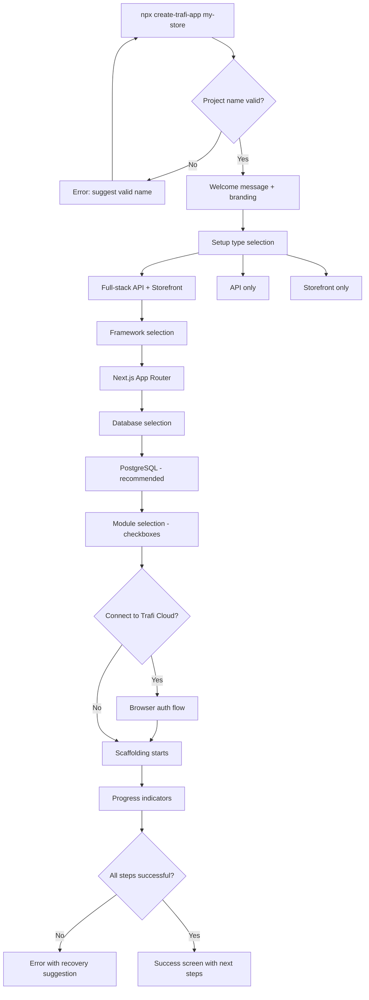
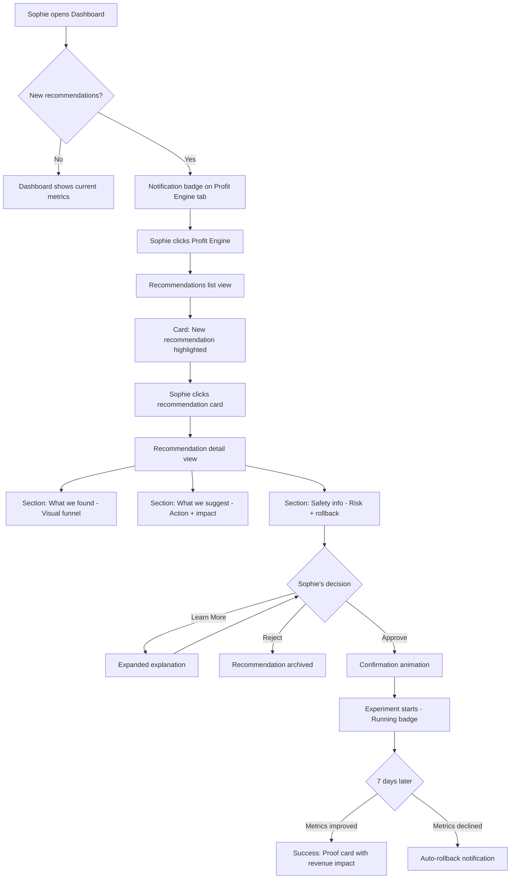
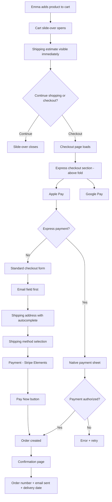
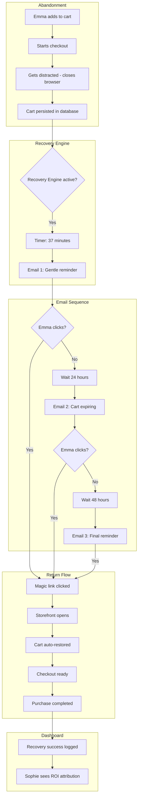

## Visual Design Foundation

### 2.1 Color Palette

**Philosophy: "The Void + The Signal"**

Trafi's color system follows a brutalist approach: pure black void punctuated by acid signals that demand attention.

#### Base Colors (The Void)

| Token | Value | Usage |
|-------|-------|-------|
| `--surface-0` | `#000000` | Main background |
| `--surface-1` | `#050505` | Cards, panels |
| `--surface-2` | `#111111` | Hover states |
| `--border` | `#333333` | The Grid — visible structure |

#### Signal Colors (The Acid)

| Token | Value | Usage |
|-------|-------|-------|
| `--primary` / `--acid-primary` | `#CCFF00` | CTA, active states, new intelligence |
| `--success` / `--acid-success` | `#00FF94` | Stability, profit, proven results |
| `--destructive` / `--neon-warning` | `#FF3366` | Risk, errors, rollback triggers |
| `--muted-foreground` | `#888888` | Labels, metadata |

#### Light Mode (Inverted)

| Token | Value | Usage |
|-------|-------|-------|
| `--background` | `#FFFFFF` | Main background |
| `--foreground` | `#000000` | Primary text |
| `--border` | `#E5E5E5` | Dividers |
| `--surface-1` | `#F8F8F8` | Cards |
| `--surface-2` | `#F0F0F0` | Hover |

#### Usage Rules

- **Never use gradients** — colors are solid and flat
- **Never use opacity for backgrounds** (except modals) — use solid colors
- **Invert colors on hover** — black text on acid background
- **No shadows** — elements sit firmly in the grid
- **No blur/glass effects** — brutalism rejects blur

#### Dark Mode as Default Identity

Dark mode is the **default** (not optional):
- Pure black (#000) creates maximum contrast
- Acid accents pop against void
- Data-dense interfaces need darkness
- Light mode available but secondary

### 2.2 Typography System

**Pairing: Space Grotesk + JetBrains Mono**

This pairing delivers "Technical Precision" — Space Grotesk is geometric and slightly wide with a "tech" feel, while JetBrains Mono handles all data and numbers with terminal authenticity.

#### Type Scale

| Element | Font | Weight | Size | Line Height | Treatment |
|---------|------|--------|------|-------------|-----------|
| H1 | Space Grotesk | 700 | 48px | 1.1 | **UPPERCASE**, tight tracking |
| H2 | Space Grotesk | 700 | 32px | 1.2 | **UPPERCASE**, tight tracking |
| H3 | Space Grotesk | 500 | 24px | 1.3 | **UPPERCASE** |
| H4 | Space Grotesk | 500 | 18px | 1.4 | **UPPERCASE** |
| Body | Space Grotesk | 400 | 14px | 1.6 | Normal case |
| Label | Space Grotesk | 700 | 10px | 1.4 | **UPPERCASE**, wide tracking (0.1em) |
| Data | JetBrains Mono | 400 | 14px | 1.5 | Numbers, metrics, values |
| Code | JetBrains Mono | 400 | 13px | 1.5 | Code, CLI output |

#### Font Usage Guidelines

- **Space Grotesk**: All headings and UI text — navigation, labels, buttons. Always uppercase for headings, tight tracking (-0.02em) or wide tracking (0.1em) for labels.
- **JetBrains Mono**: ALL numbers, metrics, table data, prices, percentages, dates. Data should look like it came from a terminal.
- **Rule**: If it's a number, it's monospace. No exceptions.

### 2.3 Layout & Density (The Grid)

**Philosophy: Separation via borders, not whitespace.**

Density is high. The interface is a professional console, not a marketing page.

#### Spacing Scale

| Token | Value | Usage |
|-------|-------|-------|
| --space-1 | 4px | Tight spacing, inline elements |
| --space-2 | 8px | Default gap, icon spacing |
| --space-3 | 12px | Form fields |
| --space-4 | 16px | Card padding |
| --space-6 | 24px | Section spacing |
| --space-8 | 32px | Large gaps |

#### Border Radius Scale

| Token | Value | Usage |
|-------|-------|-------|
| --radius-sm | **0px** | Buttons, inputs |
| --radius-md | **0px** | Cards, dropdowns |
| --radius-lg | **0px** | Modals, panels |
| --radius-xl | **0px** | Large containers |
| --radius-full | **0px** | Pills, avatars — still rectangles |

**There is no radius. Everything is a rectangle.**

#### The Border Rule

Elements are defined by their borders, not by whitespace or shadows.

**Grid Border Pattern (no double borders):**
```css
/* Parent has border-top border-left */
.brutalist-grid {
  display: grid;
  gap: 0;
  border-top: 1px solid var(--border);
  border-left: 1px solid var(--border);
}

/* Children have border-right border-bottom */
.brutalist-grid > * {
  border-right: 1px solid var(--border);
  border-bottom: 1px solid var(--border);
}
```

#### Dashboard Layout

- Fixed left sidebar: the vertical axis of the grid
- Main area: 3-4 column brutalist grid
- No card shadows — every panel is a bordered rectangle
- Gap: 0 — borders create separation

#### Storefront Layout

- Same brutalist grid pattern
- Full-bleed sections with max-width content (1280px)
- Product cards as bordered rectangles
- Checkout as single-column form in bordered container

### Accessibility Considerations

#### Contrast Requirements

| Element | Minimum Ratio | Target |
|---------|---------------|--------|
| Normal text | 4.5:1 | WCAG AA |
| Large text (18px+) | 3:1 | WCAG AA |
| UI components | 3:1 | Interactive elements |
| Focus indicators | 3:1 | Orange ring visible on all backgrounds |

#### Motion & Animation

- All animations respect `prefers-reduced-motion`
- GSAP animations use GPU-accelerated properties only (`transform`, `opacity`)
- No auto-playing videos or infinite animations
- Animation durations: 150-800ms based on context

#### Color Independence

Status indicators never rely on color alone:
- Success: Green + checkmark icon
- Warning: Yellow + triangle icon
- Error: Red + X icon
- Info: Blue + info icon

#### Keyboard Navigation

- All interactive elements focusable
- Visible focus states (2px orange outline)
- Logical tab order maintained
- Skip links for main content

### 7. Motion & Micro-interactions (Brutalist)

**Philosophy: Instant feedback. No slow fades.**

#### Timing Reference

| Context | Duration | Easing | Example |
|---------|----------|--------|---------|
| Hover states | **0ms** | instant | Color inversion, border snap |
| Button press | **0-50ms** | linear | Background change |
| Panel slide | **100ms** | ease-out | Slide from right, hard stop |
| Tab switch | **0ms** | instant | Whole tab block changes |
| Modal open | **0-100ms** | linear | Fade + slight scale |

#### Brutalist Motion Rules

- **Timing**: Instant (0-100ms). No slow fades.
- **Easing**: Linear or slight ease-out. No bounces.
- **Hover**: Instant color inversion + border snap.
- **No scaling/growing**: Keep the grid rigid.
- **Slide panels**: Hard stop from right edge.
- **Tabs**: No sliding underline. Whole block changes color instantly.

#### Performance Rules

- Use `transform` and `opacity` only — no layout-triggering properties
- Remove all `transition` by default in CSS
- Only allow transitions for specific elements (buttons, links)
- Budget: Max 16ms per frame (60fps target)

#### No "Cartoon Vibes"

Brutalism rejects playfulness. No bounces, no confetti, no easter eggs.
The machine is serious. Success is shown through data, not celebration.

## Design Direction Decision

### Design Directions Explored

Six design directions were created and evaluated:

1. **Pure Vercel** - Extreme minimalism, maximum density, pure dark mode
2. **Typology Elegance** - Refined monochrome, generous spacing, light mode storefront
3. **Bento Bold** - Expressive grids, cards with presence, pronounced orange accent
4. **Linear Flow** - Keyboard-first aesthetic, list/detail pattern, ultra-fast
5. **Creative Commerce** - Bold hero, gradients, visible GSAP animations
6. **Hybrid Pro** - Balanced synthesis of best practices with organized navigation

### Chosen Direction

**Dashboard: Bento Bold (3) + Hybrid Pro (6) Hybrid**

The dashboard combines:
- **Bento Bold's expressiveness**: Dynamic grid layouts, cards with visual presence, pronounced orange accent for Profit Engine highlights, impactful data visualizations
- **Hybrid Pro's structure**: Rail + sidebar navigation pattern, organized breadcrumb navigation, topbar with actions, status badges on cards

This creates a data-rich dashboard that feels both expressive and professional — the bento grid provides visual interest while the navigation structure keeps power users efficient.

**Storefront: Enhanced Typology Elegance (2)**

The storefront takes Typology's refined monochrome aesthetic and enriches it with modern trends:

| Enhancement | Implementation |
|-------------|----------------|
| **Bento Design** | Asymmetric hero grids, product showcases in bento card arrangements, category sections with varied card sizes |
| **Snug Simple** | Optimized padding that feels intentional not empty, elegant density without crowding, purposeful whitespace |
| **Frosted Touch** | Floating navbar with glass effect, cart slide-over with blur, modal overlays with subtle transparency |

The result is Typology's sophistication with contemporary depth and visual interest.

### Design Rationale

**Why this combination works for Trafi:**

1. **Dashboard serves power users**: Sophie needs to scan Profit Engine recommendations quickly; Thomas needs efficient navigation. The Bento grid makes data scannable while Hybrid Pro's navigation keeps everything accessible.

2. **Storefront serves brand expression**: Emma experiences the store as a brand touchpoint. Typology's elegance creates trust while Bento/Frosted trends add memorability without sacrificing performance.

3. **Consistent identity across surfaces**: Both share the monochrome + orange foundation, General Sans + Clash Display typography, and modern card-based layouts. The dark/light mode split reinforces the dashboard = tool, storefront = experience distinction.

4. **Supports the emotional goals**:
   - Dashboard: Confidence (clear data), Control (organized nav), Empowerment (actionable cards)
   - Storefront: Ease (elegant simplicity), Trust (sophistication), Delight (modern touches)

### Implementation Approach

**Dashboard Implementation:**
- 12-column CSS Grid with 16px gap
- Card component with hover states (border-color: primary)
- Rail navigation (64px) + Sidebar (240px) + Main content
- Topbar with breadcrumb + action buttons
- Status badges (success/warning/error) on metric cards
- Bento widget arrangement for Profit Engine section

**Storefront Implementation:**
- Responsive Bento grid: `grid-template-columns: repeat(auto-fit, minmax(280px, 1fr))`
- Floating header with frosted glass: `backdrop-filter: blur(12px)`
- Hero section with asymmetric 2-column layout
- Product cards with subtle hover lift
- Cart slide-over with glass background
- Full-bleed sections with max-width content constraint (1280px)

**Shared Components:**
- Button variants (primary orange, ghost, outline)
- Card base with consistent border-radius (8-12px)
- Badge component for status indicators
- Input fields with consistent styling
- Modal/Dialog with frosted overlay

## User Journey Flows

### Journey 1: CLI Onboarding (Thomas)

**Goal:** 5 minutes from `npx create-trafi-app` to functional store

**Entry Point:** Terminal command
**Success Criteria:** Working store with seed data, Profit Engine ready

#### Flow Diagram



#### Key Interactions

| Step | User Action | System Response | Optimization |
|------|-------------|-----------------|--------------|
| Command | `npx create-trafi-app` | Welcome + branding | Immediate feedback |
| Setup type | Arrow key selection | Highlight + description | Smart default selected |
| Framework | Arrow key selection | Only available options shown | Unavailable greyed |
| Database | Arrow key selection | Connection test automatic | Fail fast with help |
| Modules | Checkbox toggle | Dependencies explained | Recommended pre-checked |
| Cloud connect | Y/N | Browser auth if yes | Seamless OAuth |
| Scaffolding | Wait | Progress bars per step | Time estimates shown |
| Success | Review | Next steps + URLs | ASCII celebration |

#### Error Recovery

- Invalid project name → Suggest valid alternative
- Database connection fails → Show connection string fix
- Dependency install fails → Suggest cache clear + retry
- Cloud auth fails → Provide manual token option

---

### Journey 2: Profit Engine Approval (Sophie)

**Goal:** See diagnostic → Understand → Approve in 1 click

**Entry Point:** Dashboard notification badge
**Success Criteria:** Action approved with confidence, proof received within 30 days

#### Flow Diagram



#### Key Interactions

| Step | User Action | System Response | Emotional Goal |
|------|-------------|-----------------|----------------|
| Notice | See badge | Curiosity indicator | Intrigue |
| Browse | Click Profit Engine | List of recommendations | Discovery |
| Select | Click card | Detail view opens | Understanding |
| Evaluate | Read sections | Visual + plain language | Confidence |
| Decide | Click Approve/Reject | Immediate feedback | Empowerment |
| Monitor | Check dashboard | Running status visible | Anticipation |
| Celebrate | See results | Proof with revenue impact | Validation |

#### Safety Visualization

- **Risk Badge:** Low (green) / Medium (yellow) / High (red)
- **Rollback Promise:** "Auto-reverts in 7 days if metrics decline"
- **Guardrails Status:** "No margin impact" or warning if applicable
- **Confidence Meter:** Visual bar replacing statistical numbers

---

### Journey 3: Checkout Flow (Emma)

**Goal:** Cart → Payment → Confirmation in < 90 seconds

**Entry Point:** Add to cart action
**Success Criteria:** Order confirmed, email received, delivery date known

#### Flow Diagram



#### Key Interactions

| Step | User Action | System Response | Time Budget |
|------|-------------|-----------------|-------------|
| Add to cart | Click button | Slide-over opens | 0-5s |
| View cart | Review items | Shipping estimate shown | 5-15s |
| Start checkout | Click checkout | Page loads | 15-20s |
| Express pay | Tap Apple Pay | Native sheet | 20-35s |
| Authorize | Face ID / Touch ID | Processing | 35-45s |
| Confirm | See confirmation | Order number + email | 45-60s |

#### Fallback Path (Standard Checkout)

| Step | Fields | Optimization |
|------|--------|--------------|
| Email | 1 field | Returning customer detection |
| Shipping | Address form | Autocomplete enabled |
| Shipping method | Radio buttons | Prices + dates shown |
| Payment | Card form | Stripe Elements |
| Review | Summary | All costs visible |
| Submit | Pay button | Loading state |

---

### Journey 4: Cart Recovery (Sophie + Emma)

**Goal:** Recover abandoned carts through intelligent email sequence

**Entry Point:** Cart abandonment event (browser close during checkout)
**Success Criteria:** Customer returns and completes purchase

#### Flow Diagram



#### Email Sequence Timing

| Email | Delay | Subject | Content | CTA |
|-------|-------|---------|---------|-----|
| 1 | 37 min | Still thinking about it? | Single product image | Return to cart |
| 2 | 24 hrs | Your cart is waiting | Product + urgency | Complete purchase |
| 3 | 48 hrs | Last chance (optional) | Product + incentive | Complete purchase |

#### Recovery Flow

1. Magic link in email (no login required)
2. Storefront opens with cart auto-restored
3. Checkout page ready with all items
4. Express checkout available
5. Purchase completes
6. Sophie sees recovery attribution in dashboard

---

### Journey Patterns

#### Navigation Patterns

| Pattern | Description | Usage |
|---------|-------------|-------|
| **Progressive Disclosure** | Show essential first, expand on demand | Complex forms, settings |
| **Slide-over** | Non-blocking panel from edge | Cart, quick actions |
| **Wizard** | Step-by-step with progress indicator | CLI setup, onboarding |
| **List → Detail** | Master-detail with persistent list | Recommendations, orders |

#### Decision Patterns

| Pattern | Description | Usage |
|---------|-------------|-------|
| **Single-click Action** | No confirmation for low-risk | Approve recommendation |
| **Confirmation Modal** | Clear consequences stated | Delete, high-risk actions |
| **Inline Expand** | Accordion without page change | Learn more, details |
| **Smart Defaults** | Pre-selected recommended option | All selections |

#### Feedback Patterns

| Pattern | Description | Usage |
|---------|-------------|-------|
| **Progress Indicator** | Step count + current position | Multi-step flows |
| **Real-time Validation** | Green checkmark on valid field | Forms |
| **Toast Notification** | Auto-dismiss, non-blocking | Quick feedback |
| **Status Badge** | Color-coded, always visible | Ongoing processes |
| **Celebration Moment** | Subtle animation, positive message | Success states |

#### Error Recovery Patterns

| Pattern | Description | Usage |
|---------|-------------|-------|
| **Inline Error** | Red border + message below field | Form validation |
| **Retry Suggestion** | Clear button to try again | Failed actions |
| **Recovery Path** | Step-by-step fix instructions | Complex failures |
| **Graceful Degradation** | Continue with warning | Partial failures |

### Flow Optimization Principles

1. **Minimize Steps to Value** - Every screen must justify its existence
2. **Show Progress** - Users always know where they are and what's next
3. **Fail Fast, Recover Gracefully** - Errors caught early with clear recovery
4. **Celebrate Success** - Positive moments reinforce desired behavior
5. **Respect Time** - Mobile users especially have limited patience
6. **Reduce Cognitive Load** - One decision per screen when possible

